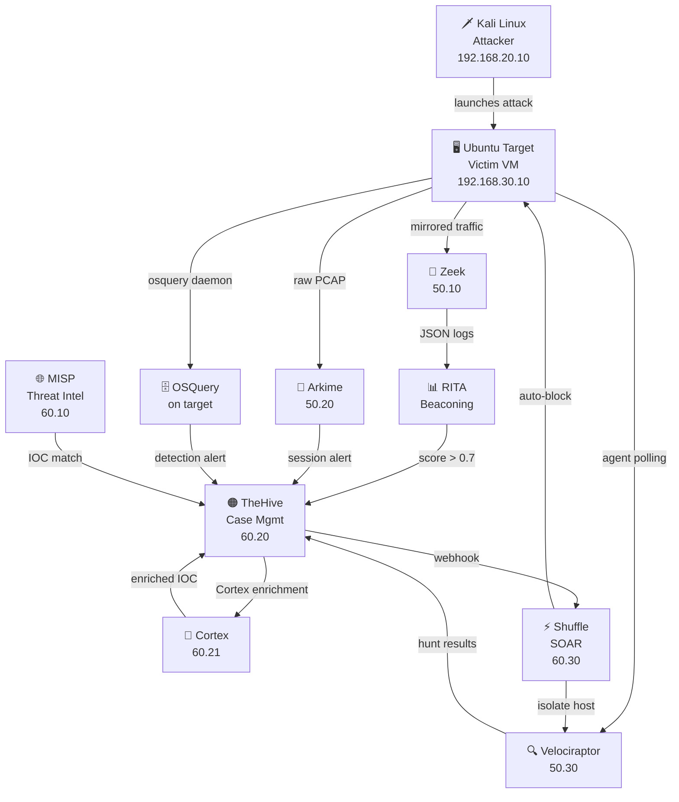

# 🔬 Advanced Threat Detection Lab

[](https://github.com/sandeepmothukuri/soc-threat-hunting-lab/actions) [](#-tools-overview) [](docs/detection-coverage.md) [](LICENSE)

> **A fully free, hands-on SOC analyst lab** — detect attacks as they happen, investigate forensically, enrich with global threat intel, and respond automatically. No paid tools. All production-grade, open-source.

---

## 🏗️ Lab Architecture



---

## 🧰 Tools Overview

| # | Tool | Category | IP | What It Detects |
|---|------|----------|----|-----------------|
| 1 | **Zeek** | Network IDS | 192.168.50.10 | DNS tunneling, port scans, webshells, lateral movement |
| 2 | **RITA** | Beaconing Analysis | 192.168.50.10 | C2 callback patterns |
| 3 | **Arkime** | Full Packet Capture | 192.168.50.20 | Network sessions and packet analysis |
| 4 | **Velociraptor** | EDR / DFIR | 192.168.50.30 | Live endpoint forensics and hunting |
| 5 | **OSQuery** | Endpoint Visibility | each target | Persistence and endpoint activity |
| 6 | **MISP** | Threat Intelligence | 192.168.60.10 | IOC enrichment and correlation |
| 7 | **TheHive** | Case Management | 192.168.60.20 | Alert triage and IR workflows |
| 8 | **Cortex** | Analysis Engine | 192.168.60.21 | IOC enrichment |
| 9 | **Shuffle** | SOAR | 192.168.60.30 | Automated response |

---

## 📡 Network Segmentation

The lab is split across isolated VLANs for attacker, target, detection and SOC/intelligence workloads.

## 🔄 Data Flow

```text
Attacker → Target → Zeek / Arkime / Velociraptor / OSQuery
                         ↓
                    TheHive / MISP
                         ↓
                     Cortex
                         ↓
                    Shuffle SOAR
                         ↓
                Response / Investigation
```

---

## ⚡ Quick Start

```bash
git clone https://github.com/sandeepmothukuri/soc-threat-hunting-lab.git
cd soc-threat-hunting-lab
sudo ./scripts/setup-host.sh
./scripts/health-check.sh
```

---

## 🎯 Hands-On Exercises

- Detect a port scan with Zeek
- Investigate C2 beaconing with RITA
- Hunt endpoints with Velociraptor and OSQuery
- Enrich IOCs through MISP and Cortex
- Automate response with Shuffle

---

## 🛡️ MITRE ATT&CK Coverage

35 MITRE ATT&CK techniques are mapped in the lab documentation and detection coverage matrix.

---

# 👤 Author

## Sandeep Mothukuri

**Senior SOC Analyst (L3) · Detection Engineering · Threat Hunting · Incident Response · Security Engineering**

Focus areas:

- Security Operations
- Detection Engineering
- Threat Hunting
- Incident Response
- SIEM / XDR
- SOAR
- DFIR
- MITRE ATT&CK
- Security Automation
- AI-Augmented SOC Operations

This repository is maintained as a practical security engineering environment for designing, testing and validating modern SOC capabilities.

- GitHub: [@sandeepmothukuri](https://github.com/sandeepmothukuri)
- Website: [cybertechnology.in](https://cybertechnology.in)
- LinkedIn: [linkedin.com/in/sandeepmothukuri](https://www.linkedin.com/in/sandeepmothukuri)
- Email: [sandeep.mothukuris@gmail.com](mailto:sandeep.mothukuris@gmail.com)

---

# 🗂️ All Repositories

| Repository | Description |
|---|---|
| [AI-Augmented-SOC-Lab](https://github.com/sandeepmothukuri/AI-Augmented-SOC-Lab) | AI-augmented SOC with Wazuh + TheHive + Ollama (LLaMA3) for automated triage |
| [Enterprise-Detection-Engineering-SOC-Lab](https://github.com/sandeepmothukuri/Enterprise-Detection-Engineering-SOC-Lab) | 12-tool SOC lab with OpenSearch, Suricata, Zeek, MISP, Caldera, Velociraptor |
| [Autonomous-SOC-Lab](https://github.com/sandeepmothukuri/Autonomous-SOC-Lab) | Autonomous SOC with AI-driven detection and self-healing playbooks |
| [soc-threat-hunting-lab](https://github.com/sandeepmothukuri/soc-threat-hunting-lab) | Threat detection lab — Zeek, RITA, Arkime, Velociraptor, OSQuery, MISP |
| [soc-lab-free](https://github.com/sandeepmothukuri/soc-lab-free) | Free SOC lab — OpenVAS, Wazuh, pfSense, Proxmox Mail, Lynis |
| [SOC-Detection-and-Threat-Hunting-Lab](https://github.com/sandeepmothukuri/SOC-Detection-and-Threat-Hunting-Lab) | SOC analyst home lab — Wazuh, Sysmon, MITRE ATT&CK mapping and incident response |
| [cyberblue](https://github.com/sandeepmothukuri/cyberblue) | Containerised blue-team platform — SIEM, DFIR, CTI, SOAR, Network Analysis |
| [PromptSentinel](https://github.com/sandeepmothukuri/PromptSentinel) | Enterprise-grade prompt injection detection and AI firewall for LLM applications |
| [PromptShield](https://github.com/sandeepmothukuri/PromptShield) | AI Security + SOC Detection Engineering Lab with prompt-security telemetry, detections and response |
| [sentinel-detection-engine](https://github.com/sandeepmothukuri/sentinel-detection-engine) | Detection-as-code for Microsoft Sentinel and Defender XDR with KQL, SOAR and ATT&CK coverage |
| [awesome-lists](https://github.com/sandeepmothukuri/awesome-lists) | SOC/DFIR detection lists, threat-hunting references and security research resources |

---
